import { Aside } from '@astrojs/starlight/components';

The IIIF Cloud Services platform uses the concept of **Spaces** to store and manage digital assets. Spaces enable you to organise your assets logically, like a folder structure. There is no limit to the number of assets you can add to a Space; however, the total number of assets is determined by the storage available to your subscription.

From the portal homepage, use the left-hand navigation to go to the **Spaces** area. This is where digital assets are stored and managed. Any Spaces you have already created will be listed here.

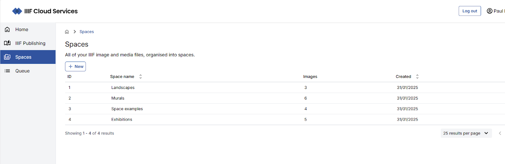

## Uploading assets manually

The portal provides two routes for preparing and delivering your digital assets as IIIF-enabled assets:

- Uploading images directly via the browser
- Creating a CSV file detailing your digital assets and uploading it for batch processing

You can create a new Space or add your assets to an existing one. To create a new Space, click **New space** and give it an appropriate name.

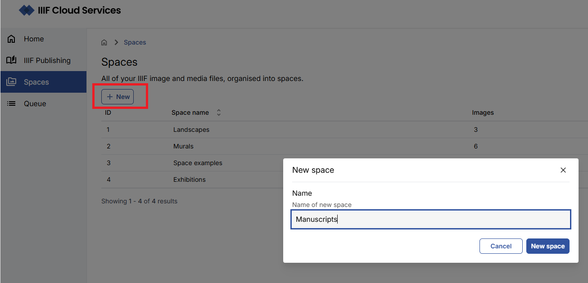

<Aside type="note">
Each Space is given a numeric identifier automatically. The name is only used for management within the IIIF CS Portal and is not visible in any IIIF output.
</Aside>

### Manually uploading images

In the Space view, use the **browse files** link to select your images, or drag and drop them into the upload area. The maximum number of images that can be manually uploaded at one time is **10**.

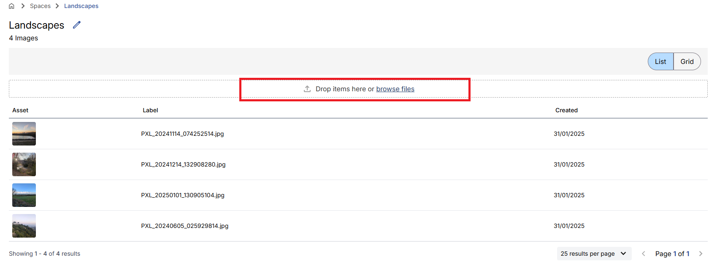

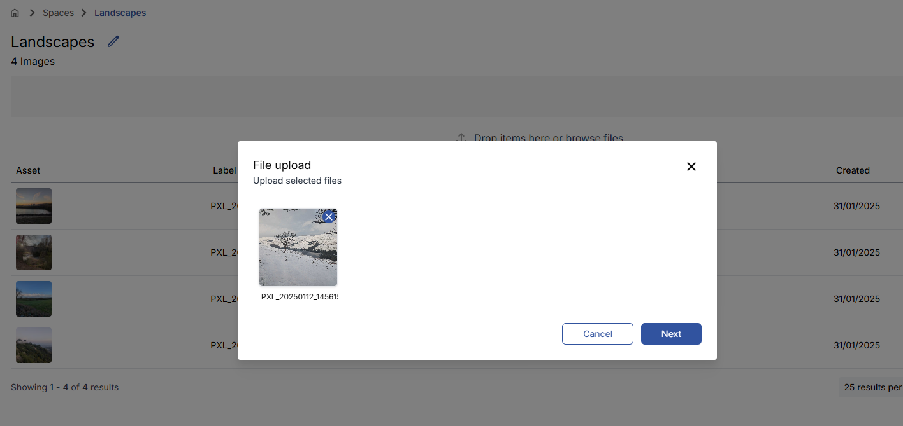

Clicking **Next** takes you to a metadata input screen where you can add String and Number metadata values to the images. These are optional unless you need to retrieve your assets via API calls using your own resource identifiers.

Clicking **Upload** adds the images to your selected Space.

### Uploading assets via CSV

The portal supports bulk asset ingestion via CSV file. This allows you to specify images, video, and audio assets for processing in a single operation.

#### Creating a CSV file

To access the CSV upload feature, navigate to the **Queue** area and select **Add new batch**.

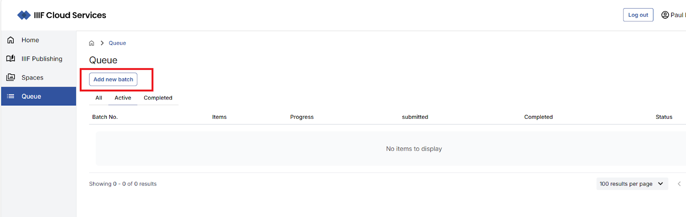

On the **Import Assets via CSV** page you can download a sample CSV file to use as a starting point.

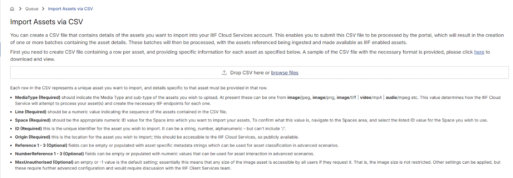

Each row in the CSV represents a unique asset. The table below describes the available fields.

| Field | Mandatory? | Description |
|:------|:-----------|:------------|
| Line | Yes | A unique reference number for each row, used in validation. |
| ID | Yes | A unique identifier for the asset. Can be a string, number, or alphanumeric value — must not contain `/`. |
| MediaType | Yes | The media type of the asset, e.g. `image/jpeg`, `image/png`, `image/tiff`, `video/mp4`, `audio/mpeg`. |
| Space | Yes | The numeric ID of the Space into which the asset should be imported. |
| Origin | Yes | A publicly accessible URL pointing to the asset. |
| Reference1–Reference3 | No | Optional string metadata values for asset classification. |
| Number1–Number3 | No | Optional numeric values for asset interaction in advanced scenarios. |
| MaxUnauthorised | No | Leave empty or set to `-1` for the default (no size restriction). Other values require further configuration. |

#### Importing a CSV file

Once your CSV is ready, upload it on the **Import Assets via CSV** page.

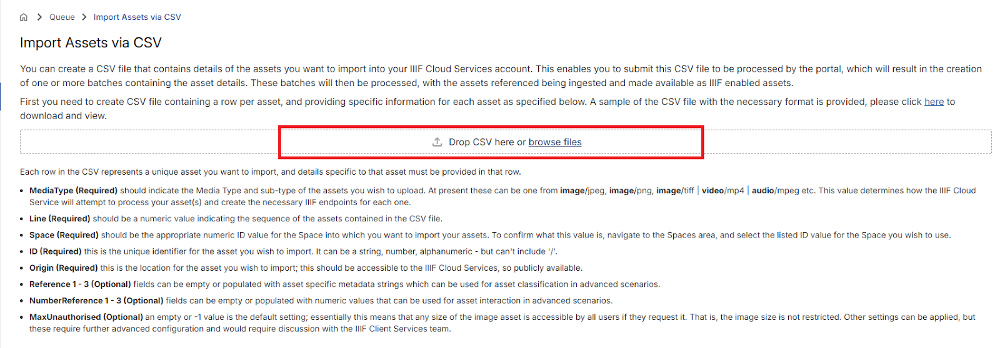

If the file is correctly formatted, a preview of the contents will be displayed. Any errors will be highlighted. If there are more than 100 rows, the preview is paged in batches of 100.

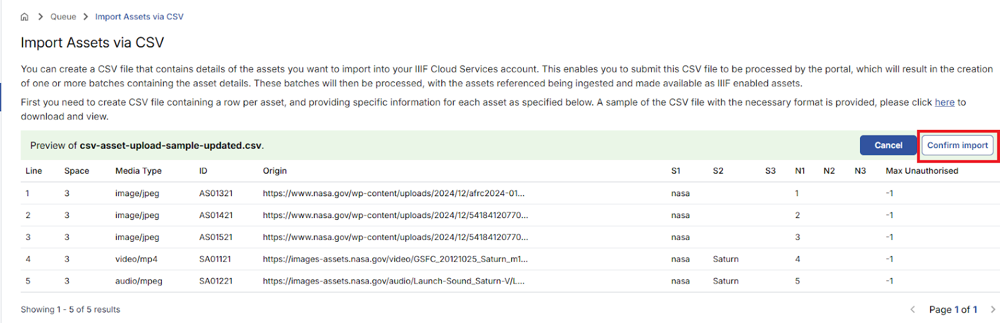

When you are ready to proceed, select **Confirm import** and then **Start Ingest**.

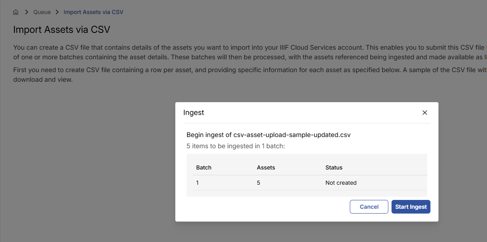

After starting the ingest, you can click **View queue** to monitor progress, or continue working in the portal.

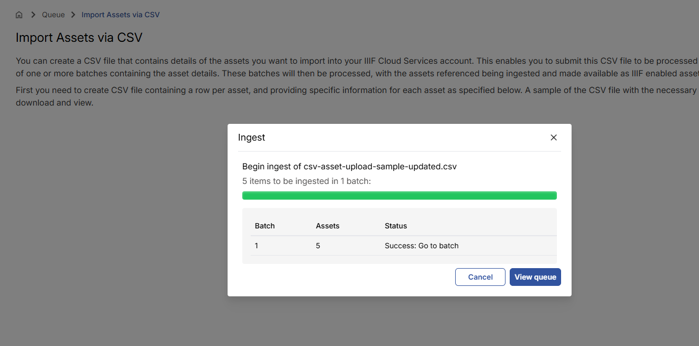

#### Viewing import progress

The **Queue** area shows all active and completed batch import processes.

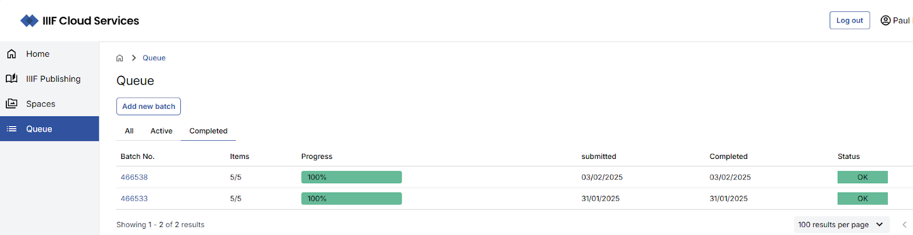

Clicking on a batch navigates to a batch view listing all assets associated with it.

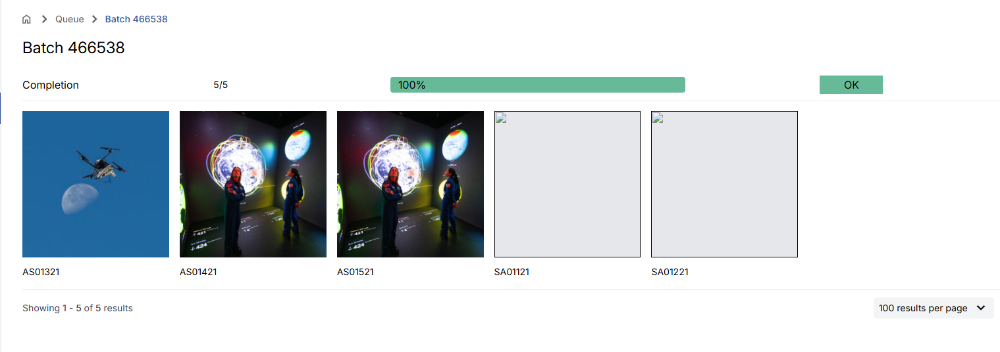

## Using the API to import assets

Assets are typically ingested into the IIIF Cloud Service via automated processes — for example from an institution's collection management system or digital preservation system. These scenarios can be discussed with your Digirati contact.

## Viewing and editing asset details

Navigate to the Space containing your assets to view and interact with them.

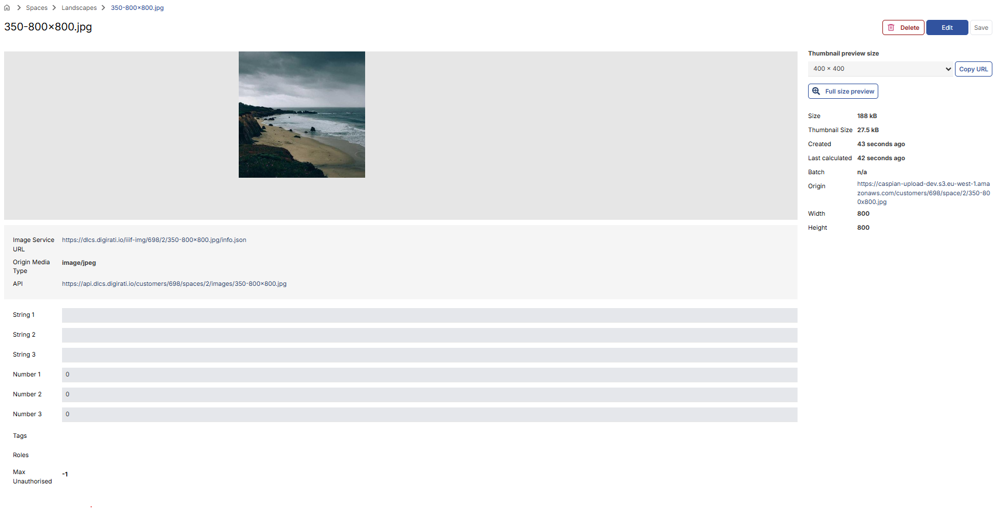

The platform creates the necessary IIIF Image API endpoints and derivatives for your images. Once processed, a deep zoom version of the asset is available, along with image metadata and IIIF service information.

The Thumbnail preview options allow you to examine or share specific sizes of the image.

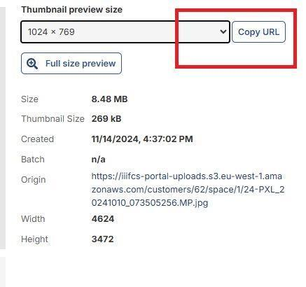

Select a size, click **Copy URL**, then open a new browser tab and paste the URL to view the image at that size.

For non-image assets, appropriate playback controls are displayed.

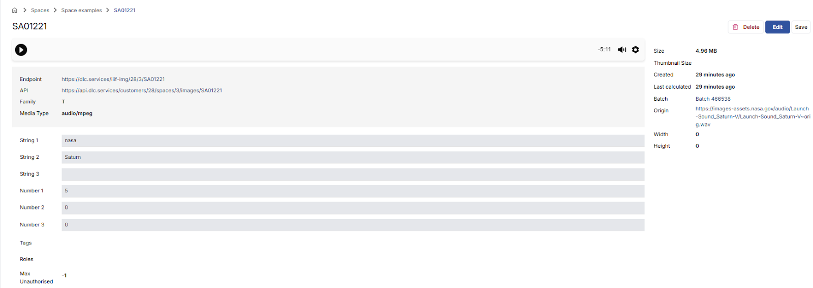

To edit the metadata for a specific asset, use the **Edit** option. You can then save or cancel your changes.

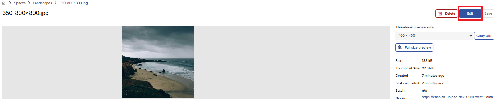

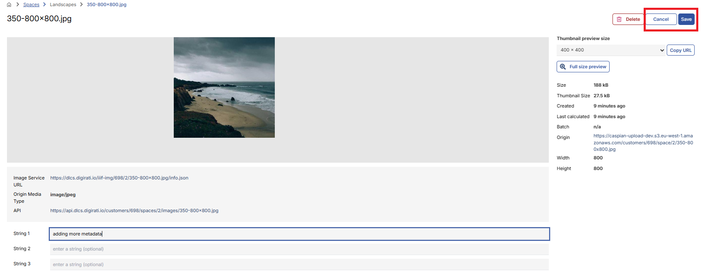
