import { Aside } from '@astrojs/starlight/components';

Before you can publish assets through IIIF Cloud Services, you need to store them in a **Space**. Spaces help you organise related assets, such as a collection or project, and provide a location for uploading and managing assets. There is no limit to the number of assets within a Space. However, the total amount of content you can store depends on the storage allocation included in your subscription.

From the portal homepage, use the left-hand navigation to browse to the **Spaces** area. This is where digital assets are stored and managed. Any Spaces you have already created will be listed here.

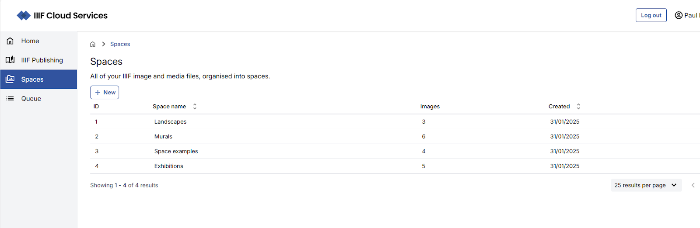

## Uploading assets manually

The portal provides two routes for preparing and delivering your digital assets as IIIF-enabled assets:

- Uploading images directly via the browser
- Creating a CSV file detailing your digital assets and uploading it for batch processing

You can create a new Space or add your assets to an existing one. To create a new Space, click **New space** and give it an appropriate name.

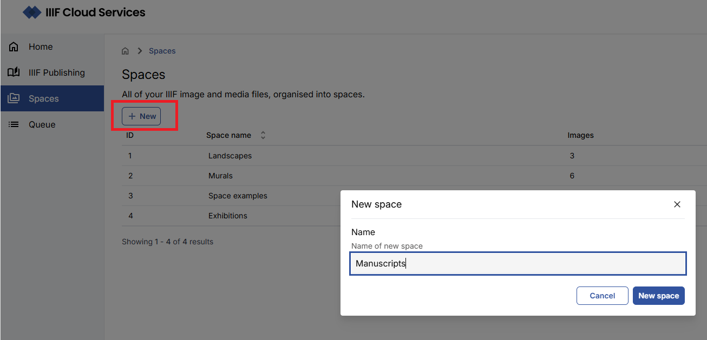

<Aside type="note">
Each Space is assigned a numeric ID automatically. The Space name is used only within the Portal and does not appear in IIIF manifests, Image API URLs, or public outputs.
</Aside>

### Uploading assets through the Portal

#### Overview

- (1) Open the required Space.
- (2) Select Browse files or drag files into the upload area.
- (3) Select up to 10 images for upload.
- (4) Select Next.
- (5) (Optional) Add metadata values.
- (6) Select Upload.

#### Detailed instructions

In the Space view, use the **browse files** link to select your images, or drag and drop them into the upload area. You can upload up to **10** images per upload operation.

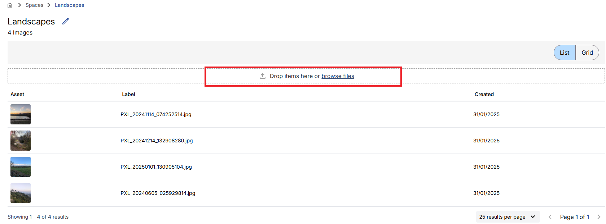

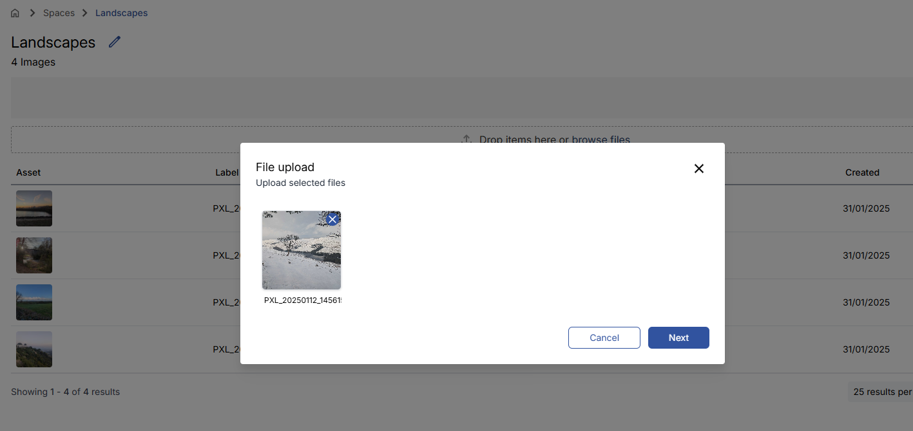

Clicking **Next** takes you to a metadata input screen where you can add String and Number metadata values to the images. You can optionally add metadata values to help identify, categorise, or retrieve assets later. For example:

- String values might contain collection names, accession numbers, or shelf marks.
- Number values might contain identifiers or classification codes used by other systems.

These are optional, however some customers use them to support classifying the assets in additional ways, or if you plan to retrieve your assets via API calls to support other use cases.

Clicking **Upload** adds the images to your selected Space.

<Aside type="note">
The asset metadata values (String1-String3 and Number1-Number3) are also used to support creating IIIF Manifests directly from a Space. See section TBC
</Aside>

The system automatically sanitizes uploaded asset filenames containing spaces and special characters (/[^A-Za-z0-9._:~-]+/g) into safe web-friendly identifiers, to help prevent failed uploads.  

### Uploading assets via CSV

CSV import allows you to upload large numbers of assets in a single operation. Each row in the CSV file represents one asset and tells the platform where to find the source content and how it should be identified.This allows you to specify images, video, and audio assets for processing in a single operation.

#### Creating a CSV file

To access the CSV upload feature, navigate to the **Queue** area and select **Add new batch**.

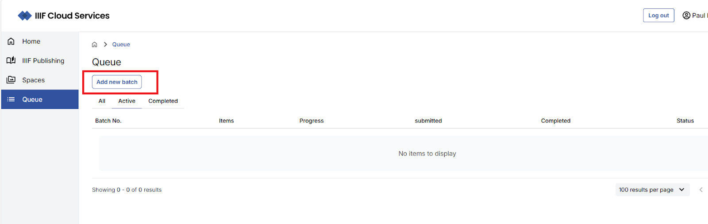

On the **Import Assets via CSV** page you can download a sample CSV file to use as a starting point.

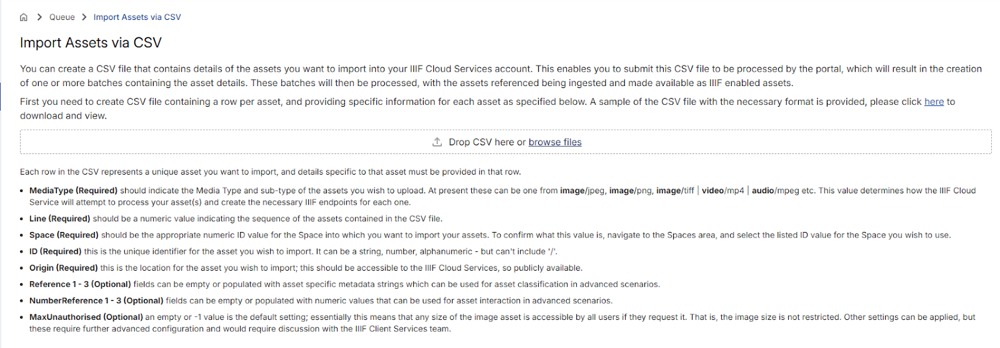

Each row in the CSV represents a unique asset, for example:

| Line |	ID	| MediaType |	Space |	Origin | Reference1 |	Reference2 | Reference3 |	NumberReference1 | NumberReference2 |	NumberReference3 | MaxUnauthorised |
|:-----|:-----|:----------|:------|:-------|:-----------|:-----------|:-----------|:-----------------|:-----------------|:-----------------|:----------------|
| 1	| AS01321 |	image/jpeg |	1	| https://www.nasa.gov/wp-content/uploads/2024/12/afrc2024-0166-033orig.jpg |	nasa |	drone |	|	1 |	| |		-1 |

The table below describes the available fields.

| Field | Mandatory? | Description |
|:------|:-----------|:------------|
| Line | Yes | A unique row number used to identify validation errors within the import file. |
| ID | Yes | A unique identifier for the asset. Can be a string, number, or alphanumeric value — must not contain `/`. |
| MediaType | Yes | The media type of the asset, e.g. `image/jpeg`, `image/png`, `image/tiff`, `video/mp4`, `audio/mpeg`. |
| Space | Yes | The numeric ID of the target Space where the asset will be created. |
| Origin | Yes | The publicly accessible URL where the source file can be downloaded during import. |
| Reference1–Reference3 | No | Optional string metadata values used for asset classification. |
| Number1–Number3 | No | Optional numeric metadata values for asset classification. |
| MaxUnauthorised | No | Leave empty or set to `-1` for the default (no size restriction). Other values require further configuration. |

<Aside type="caution">
The URL specified in the Origin column must be accessible to the ingestion service. URLs that require authentication or are protected by firewalls may fail to import.
</Aside>

#### Importing a CSV file

Once your CSV is ready, upload it on the **Import Assets via CSV** page.

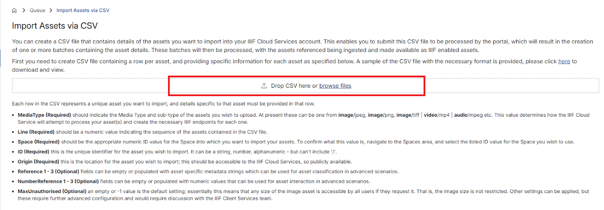

If the file is correctly formatted, a preview of the contents will be displayed. Any errors will be highlighted. If there are more than 100 rows, the preview is paged in batches of 100.

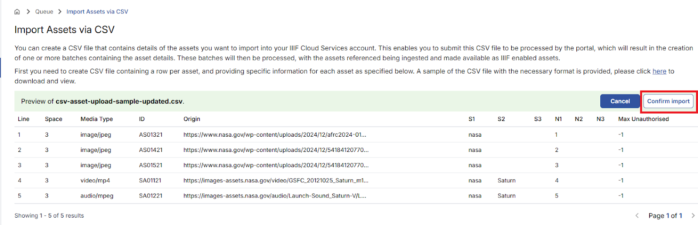

When you are ready to proceed, select **Confirm import** and then **Start Ingest**.

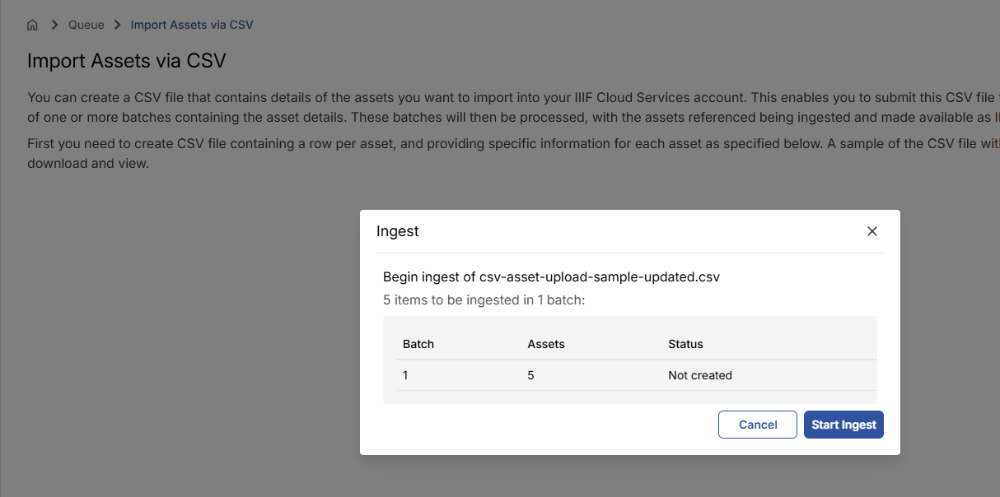

After starting the ingest, you can click **View queue** to monitor progress, or continue working in the portal.

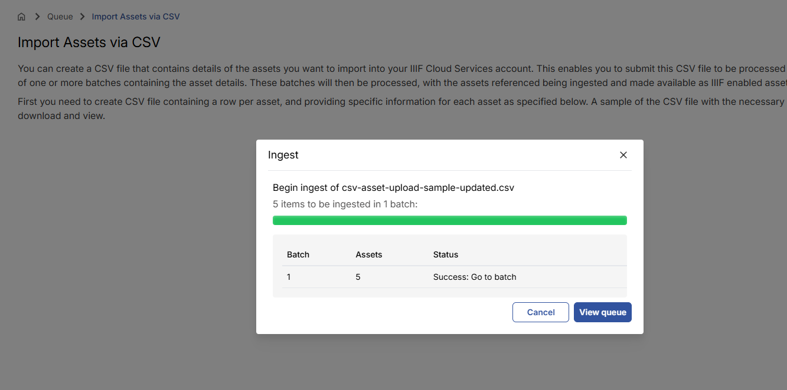

#### Viewing import progress

The **Queue** area shows all active and completed batch import processes.

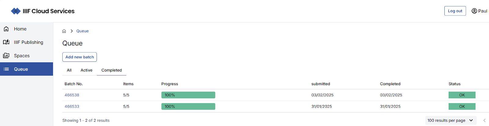

Clicking on a batch navigates to a batch view listing all assets associated with it.

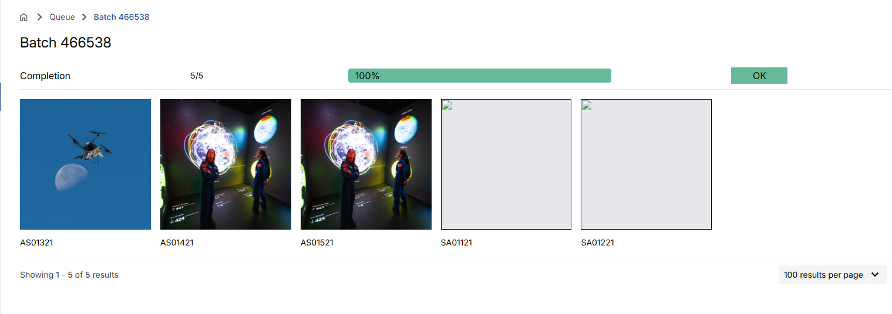

## Viewing and editing asset details

Navigate to the Space containing your assets to view and interact with them.

### View asset details

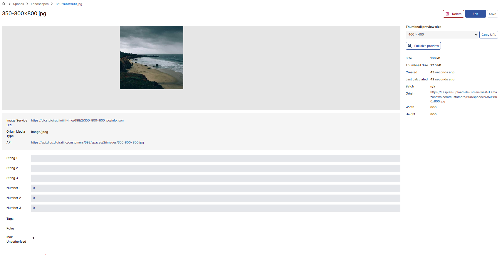

When an  asset has been successfully uploaded into the platform, the necessary IIIF Image API endpoints and derivatives (for example web friendly image sizes) for your assets are created. Once processed, a deep zoom version of the asset is available, along with image metadata and IIIF service information. Opening the asset item displays these details; the preview area displays the zoomable image, video, or audio with appropriate controls. The IIIF Image URL is available to copy, while other format, asset size, created and update dates and other metadata are displayed.

### Download or share image URLs

Use the thumbnail controls to generate links to commonly used image sizes which are generated by the system.

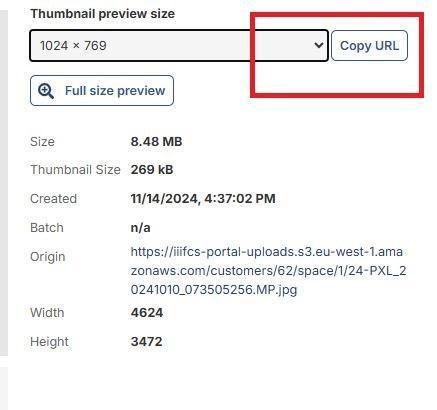

Select an image size and choose **Copy URL** to copy a direct link to that version. You can then:

- Open it in a browser
- Share it with colleagues
- Use it within a website or application as required

For non-image assets, appropriate playback controls are displayed.

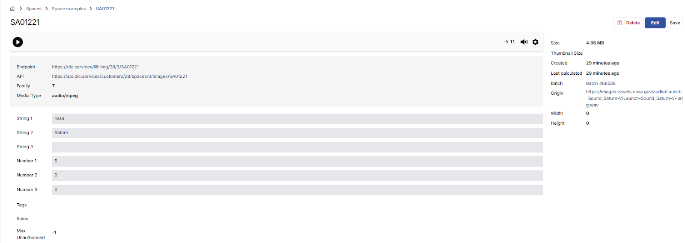

To edit the metadata for a specific asset, use the **Edit** option. You can then save or cancel your changes.

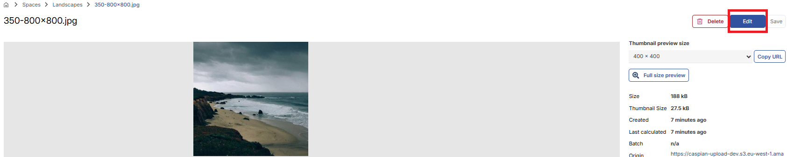

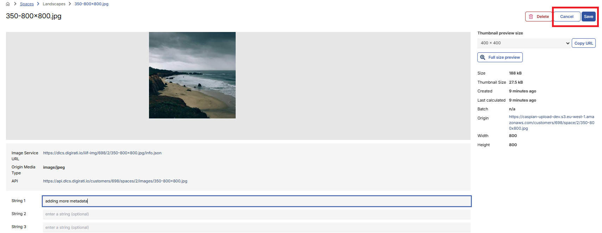

## Creating IIIF Manifests from a Space

Curators can now generate IIIF manifests directly from Space assets with a single click. The functionality includes pre-Manifest generation previews, flexible asset splitting rules (single manifest, 1-per-asset, or grouping by metadata attributes string1/string2/string3), custom folder destination selection, and inline manifest labeling.

### Overview

- (1) Open the required Space.
- (2) Select the 'Manifest from Space' option from the '+New' content menu
- (3) This action opens the IIIF Builder view that describes the process and presents the options
- (4) Select the Destination folder for the Manifest(s) you wish to create from the Space
- (5) Select the Split option you wish to use for creating the Manifest
- (6) Use an Empty manifest template (i.e. no predefined metadata attributes) or select an existing template for the new Manifest(s)
- (7) Select 'Preview manifests' to view the available Manifests that can be generated based on your selections
- (8) In the 'Preview of Manifests' list view you can edit the label(s) of the Manifests to be generated
- (9) The 'Generate' links enable individual Manifest generation or you can generate all
- (10) Cancel to return to the IIIF Builder view where you can modify the criteria for Manifest generation and then preview once more

### Detailed instructions

Navigate to the Space from which you want to generate Manifests directly.

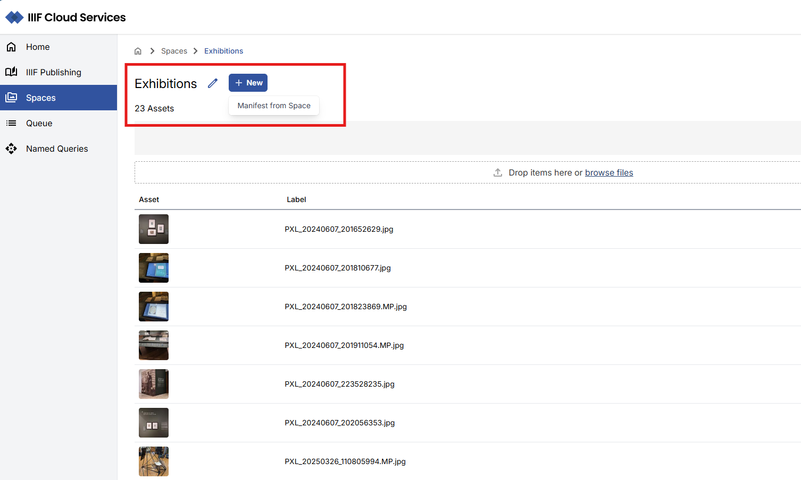

This will open the IIIF Builder view, which provides context on the process and presents the options for:

- Choose your destination folder within your IIIF Publishing area
- Select how you want to split the assets for inclusion within the Manifest(s)
- Select to use an existing Manifest template or just use the default empty manifest (you can add metadata later after the Manifest(s) have been created - see section 'IIIF Manifests' for details) 

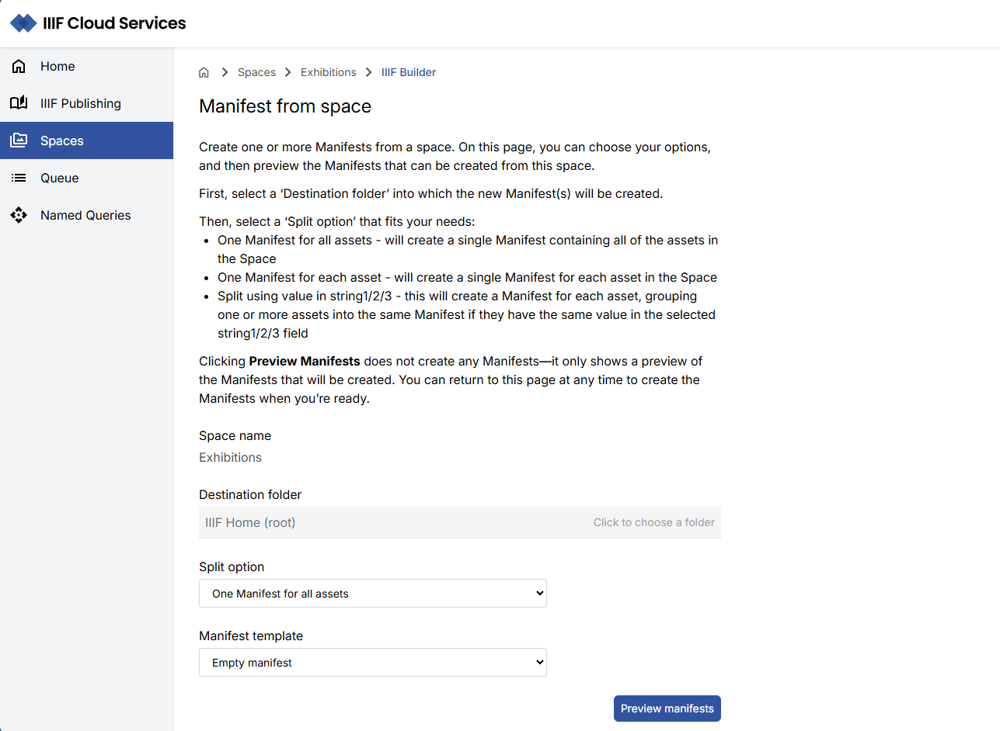

#### Destination folder

Manifest(s) generated from this process can be stored in the appropriate folder location within your IIIF Publishing area. Using the IIIF Browser, select the appropriate folder location. Any Manifests generated will then be automatically created within that folder and can be accessed through your IIIF Publishing area.

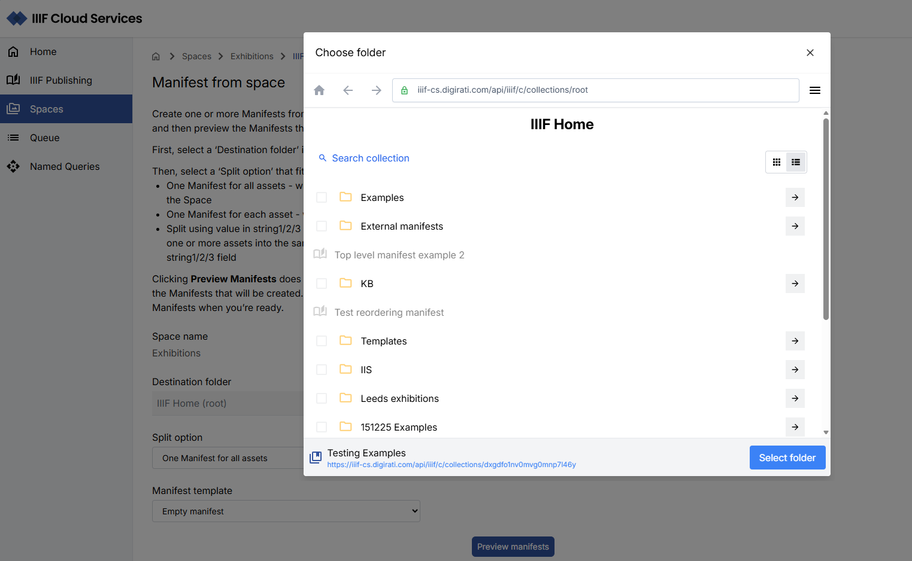

#### Asset splitting rules

The 'Split option' list enables assets to be split in differing ways:

- (1) One Manifest for all assets - creates a single Manifest with all of the assets, ordered by date created
- (2) One Manifest for each asset - creates a Manifest per asset
- (3) Split using value in string1 - splits the assets using the values in the asset metadata, string1 field. It groups any assets that share the same value into a single Manifest, with a Manifest per value.
- (4) Split using value in string2 - splits the assets using the values in the asset metadata, string2 field. It groups any assets that share the same value into a single Manifest, with a Manifest per value.
- (5) Split using value in string3 - splits the assets using the values in the asset metadata, string3 field. It groups any assets that share the same value into a single Manifest, with a Manifest per value.

Once you have selected the values - you can then preview the list of Manifests that will be generated. Note you can always return and change the options before actually creating any Manifests.

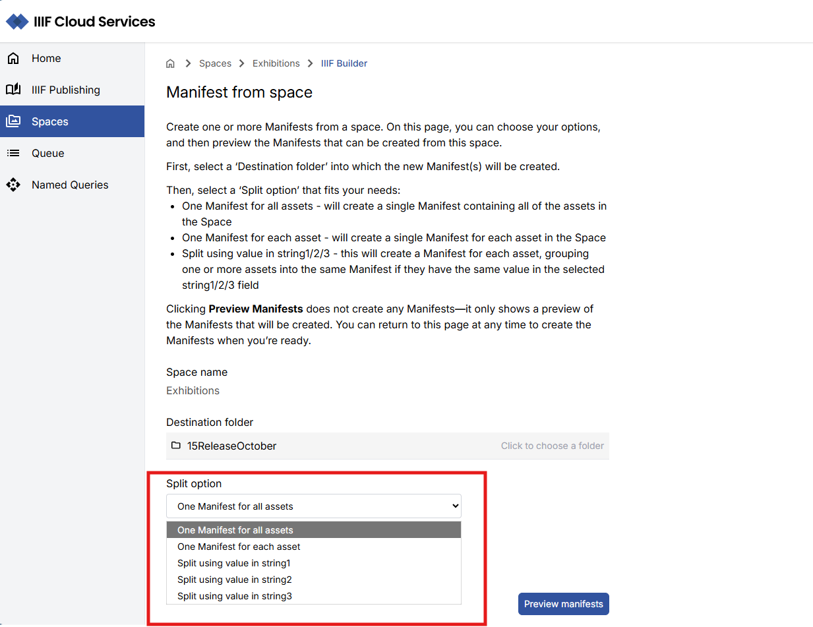

### Preview of Manifests

The Preview listing view presents the Manifest(s) that are available for generation from your selection. You can use the pencil icon to edit the Manifest label for each Manifest listed. 

You can use the 'Generate all' option to generate all of the available Manifests, or you can selectively generate specific Manifests in the list using the appropriate 'Generate' option.

The 'Cancel' option will navigate you to the IIIF Builder view enabling you to modify the options as required.

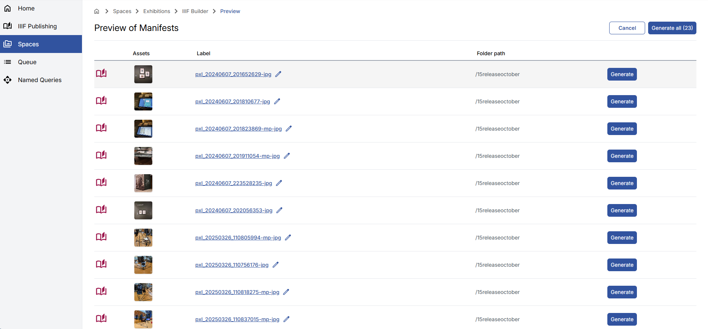

### Navigating to generated Manifests

After you select to Generate one or more Manifests, a link to the Manifest(s) will be available allowing you to navigate directly to the Manifest and continue with any editing or updating of the content.

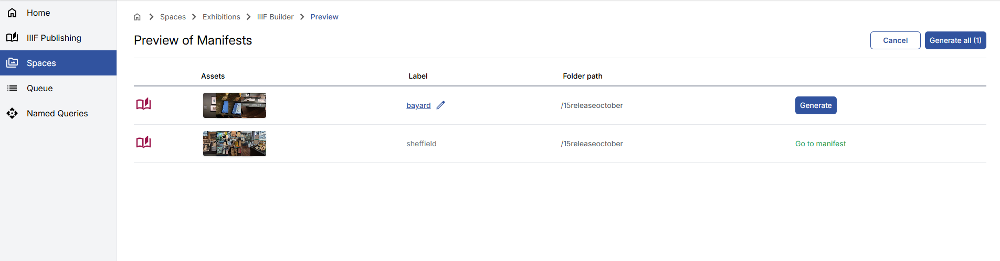

## Using the API to import assets

Assets are typically ingested into the IIIF Cloud Service via automated processes — for example from an institution's collection management system or digital preservation system. The approaches are documented in the 'The API' section of the documentation. These scenarios can be discussed with your Digirati contact.

