import { Aside } from '@astrojs/starlight/components';

IIIF Collections allow you to group Manifests and other Collections together into a structured hierarchy. The portal enables you to create new collections, import existing ones, and manage their contents.

## Creating a new collection

Within the IIIF Publishing area, click **New** and select **Collection**.

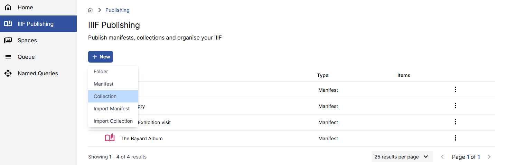

Give the Collection a **Label** and an optional **Summary**. The **Slug** will be auto-populated from the Label.

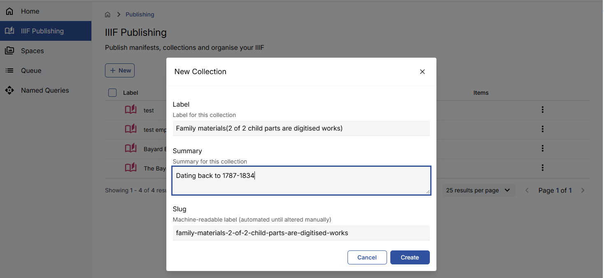

Click **Create**. You will be taken to the Collection view, where the empty Collection is displayed.

## Editing collection metadata

Click the pencil icon, then **Edit** to edit the basic Collection metadata.

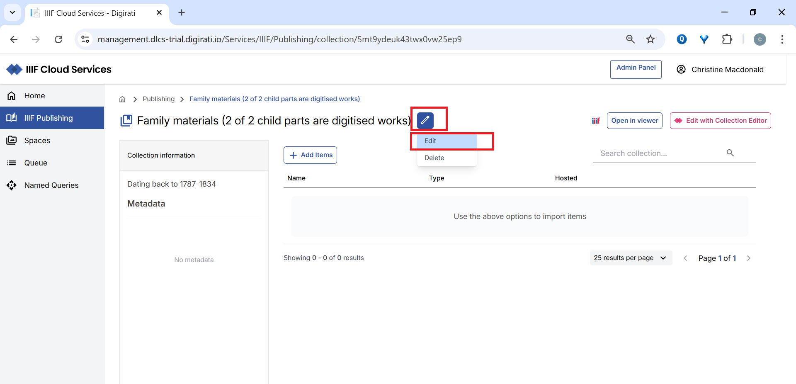

Edit the metadata and click **Save**, or click **Cancel** to discard your changes.

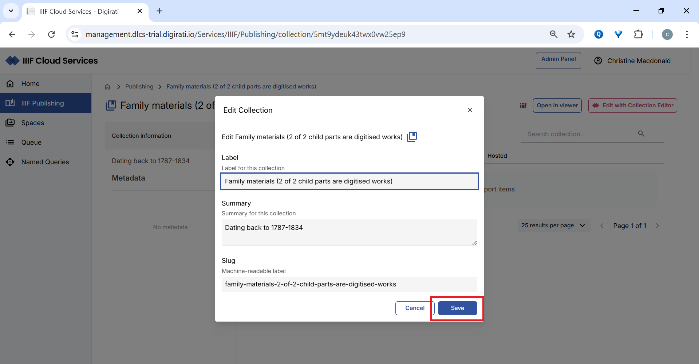

## Adding items to your collection

Add Manifests and other Collections using the **Add items** button, which opens the IIIF Browser.

<Aside type="note">
If you navigate to another folder in the IIIF Browser without adding selected items, the selection will be reset.
</Aside>

You cannot add a Collection to itself — it will appear disabled in the IIIF Browser. You can add any other Collection or Manifest, but each item can only appear once in the same Collection.

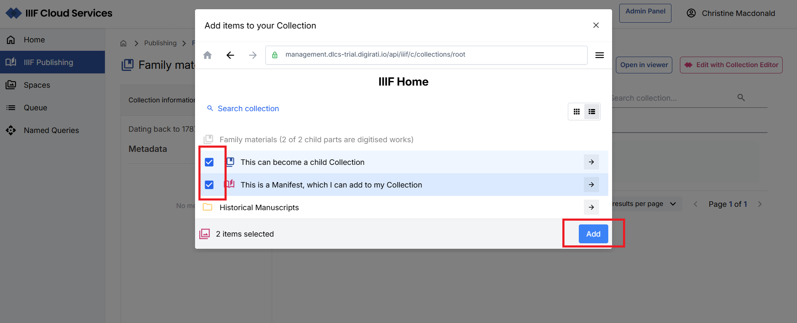

You can also add external content directly by pasting a URL into the IIIF Browser.

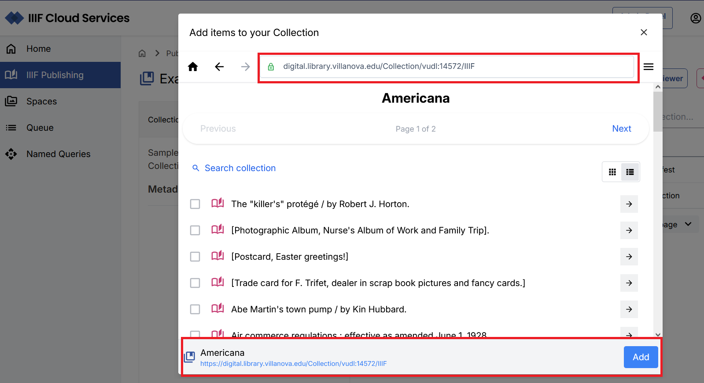

Once added, the items are listed within the Collection in the order they were added. Items hosted within your IIIF Publishing area are marked **INTERNAL**; items from external sources are marked **EXTERNAL**.

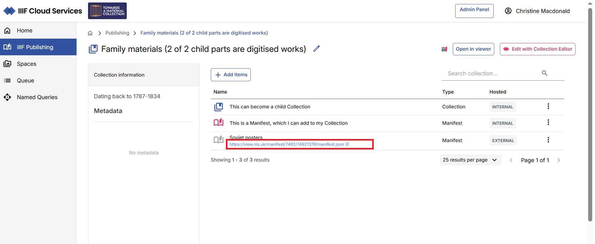

<Aside type="caution">
If an internally hosted Manifest or Collection is moved or its slug is changed, links to it within Collections will break. You will need to remove and re-add the item.
</Aside>

## Deleting an item from your collection

Click the **⋮** menu to the right of the item and select **Remove**.

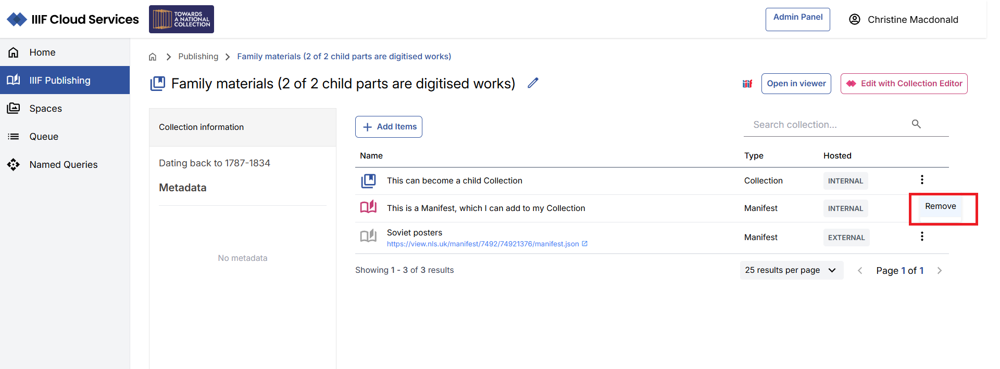

## Viewing your collection

Using the **Open in Viewer** option, you can view your Collection in:

- Theseus
- Mirador

A link to the IIIF Collection (via the IIIF icon) is also available to drag and drop into viewers that support IIIF Collections.

## Edit with the Collection Editor

Click **Edit with Collection Editor** to view and edit the Collection in detail.

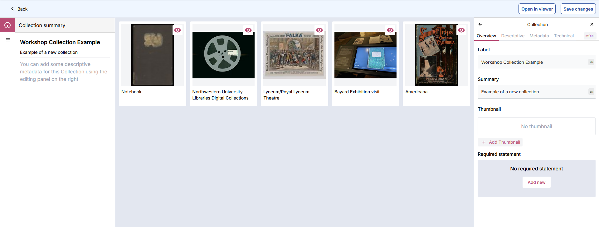

The default view shows the Collection summary in the left panel, with detailed metadata in the right panel. You can add metadata and other IIIF Collection properties using the right panel.

You can also set a thumbnail for the Collection by navigating to the relevant Canvas preview and selecting it.

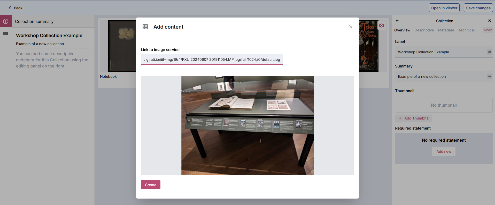

## Updating collection contents

Click the **Collection items** icon in the left panel to navigate to the Manifests and Collections view.

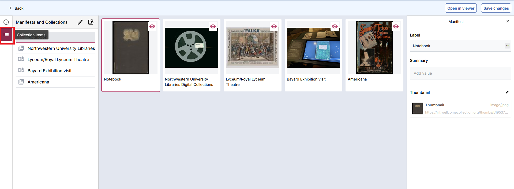

In this view, the right panel shows summary information for the selected item. You can edit the basic metadata for IIIF content within the context of the Collection (this does not affect the underlying item itself).

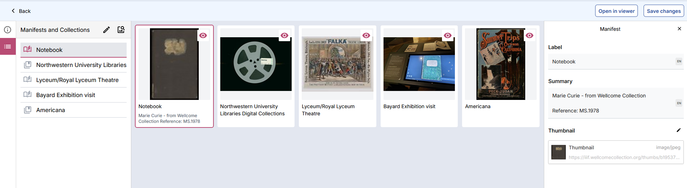

To reorder items, click the **Edit items** (pencil) icon in the left panel and use the **=** drag icon to rearrange.

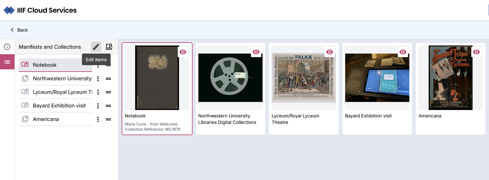

Additional ordering options and **Delete** are available from the **⋮** menu next to each item.

To add more content, click **IIIF Browser** to open the browser and search for additional internal or external content.

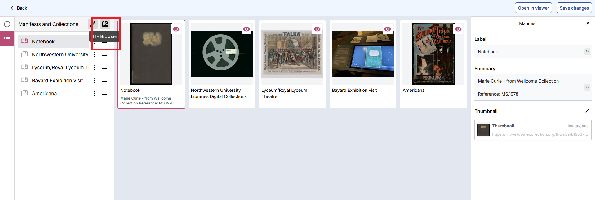

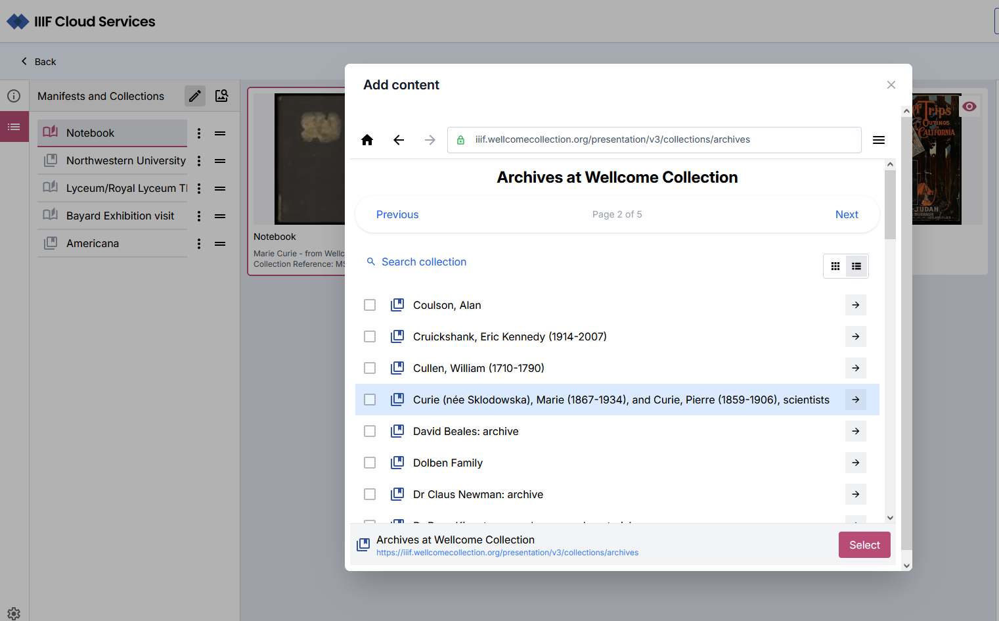

Click **Save changes** when finished. Use the **Back** link to return to the portal Collection view.

## Importing an existing collection

Navigate to the IIIF Publishing area and select the destination folder. Click **New**, then select **Import Collection**. Enter the URL of a valid IIIF Collection and click **Import**.

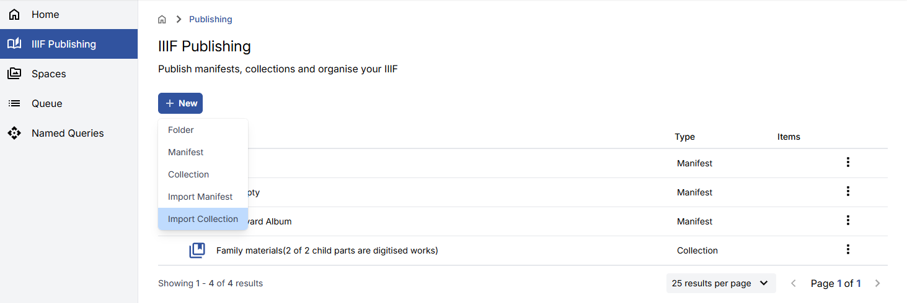

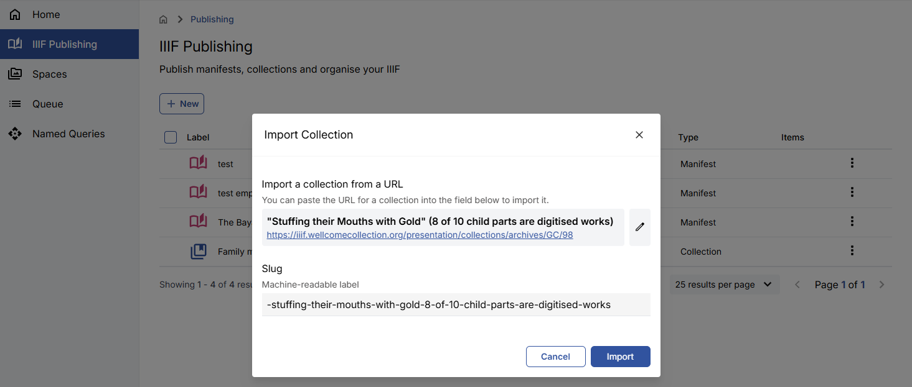
