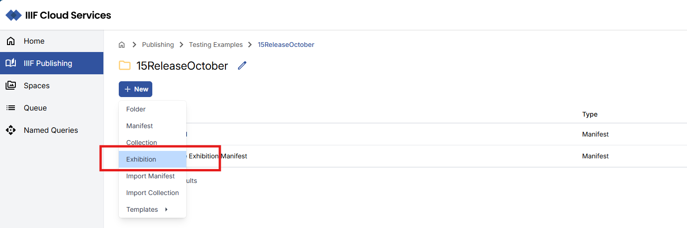
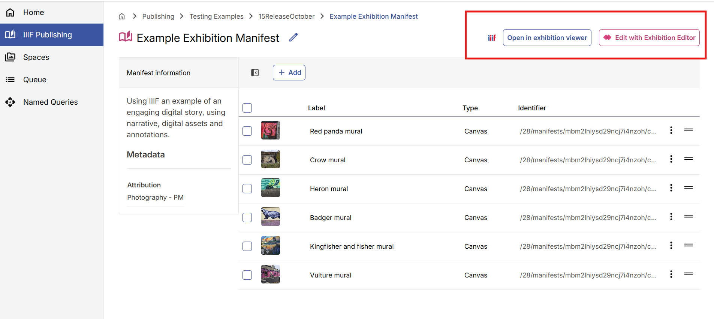
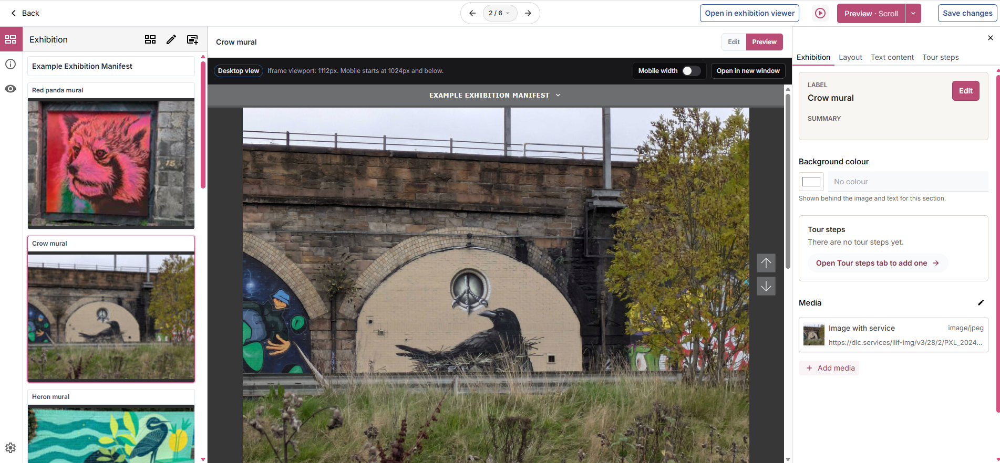
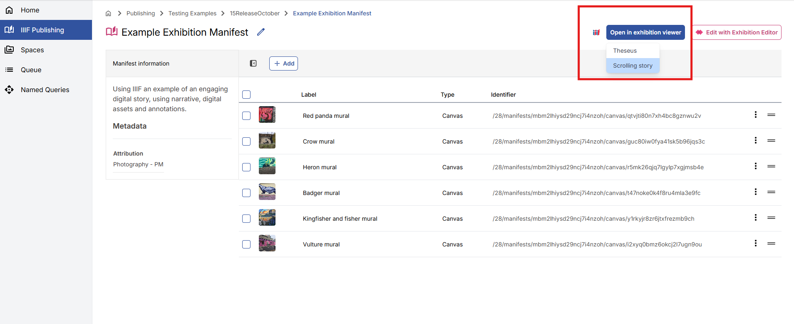
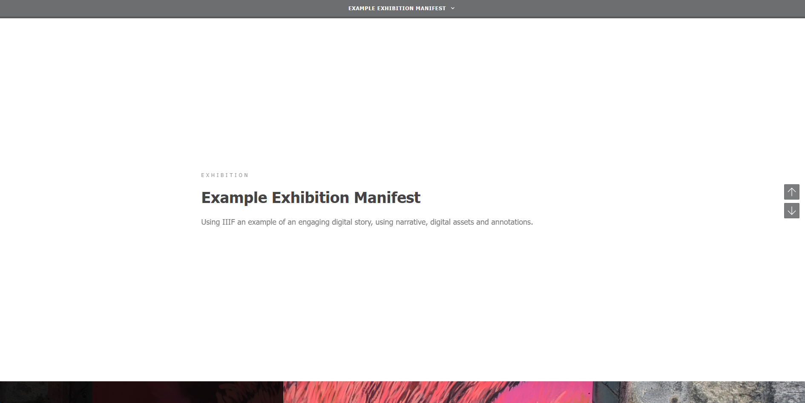

import { Aside } from '@astrojs/starlight/components';

The IIIF Cloud Services platform now includes an Exhibition Editor that allows you to create narrative experiences using your IIIF assets and manifests. Exhibitions can combine images, media, descriptive text, and structured layouts to create online stories, teaching resources, highlights collections, and virtual exhibitions. 

From any folder within the IIIF Publishing area, you can now select to create Exhibition Manifests.

## Creating a New Exhibition

Exhibition Manifests can be managed in a similar way to standard IIIF Manifests in the portal, the key differences relate to the editorial and viewing tools you can use to work with the exhibition content.

To create a new exhibition:

- Navigate to an appropriate folder in your IIIF Publishing area
- Select New  -> Exhibition.
- Enter a label for the exhibition and summary for the exhibition.
- Select Create, which will create the empty Manifest

### Edit with Exhibition Editor

Using the Edit with Exhibition Editor link, you can open your Manifest and start to develop the exhibition. 

<Aside type="note">
For full details on how to curate Exhibitions in the Exhibition Editor, please refer to https://manifest-editor-docs.netlify.app/docs/exhibition-building.
</Aside>

### Viewing your Exhibition Manifest

The Exhibition Editor provides a number of options to preview the exhibitions - within the centre panel and there are also links to view the exhibition in the standalone exhibition viewer.

From the standard Portal Manifest view you can also select to Preview your exhibition:

This will open the exhibition in the exhibition viewer:

