import { Aside } from '@astrojs/starlight/components';

The IIIF Cloud Services platform enables you to create new or import existing IIIF content. You can create IIIF Manifests using assets you have added to your Spaces, or import a copy of an existing manifest.

Importing external manifests copies the manifest information without altering the source. This allows you to augment and republish external IIIF content, or use it as the basis for new work.

## Using folders to manage IIIF content

Navigate to the **IIIF Publishing** area within your portal. You can create folders to organise your IIIF content by giving each folder a label.

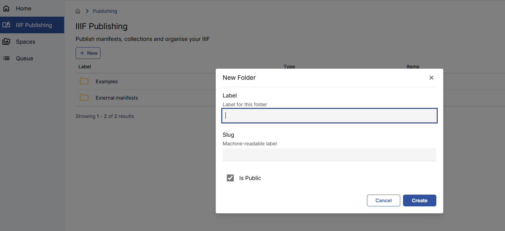

## Creating a new manifest

Using the **New** option, select **Manifest** to create a new empty Manifest.

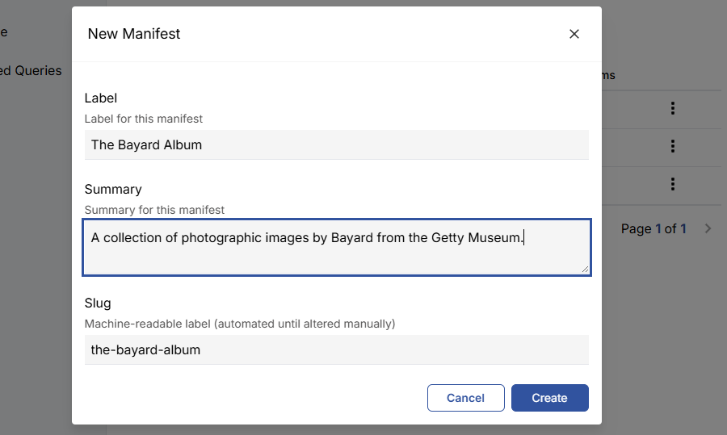

Give your manifest a **Label** to identify it and an optional **Summary** to describe its contents. The **Slug** will be auto-populated from the Label — you can change it if needed.

Click **Create** to generate the new Manifest. You will then be taken to the Manifest view, where the empty manifest is displayed.

## Editing and viewing your manifest

### Adding assets from your Spaces

In the Manifest view, you can edit the basic metadata and select one or more assets from your Spaces to add as Canvases.

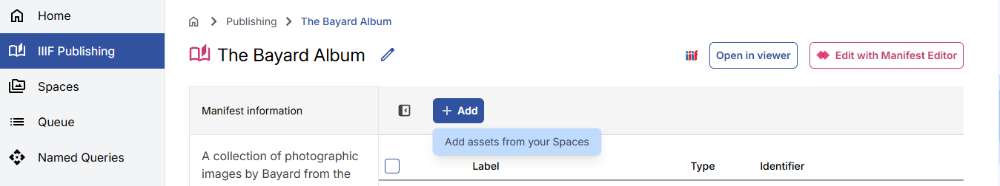

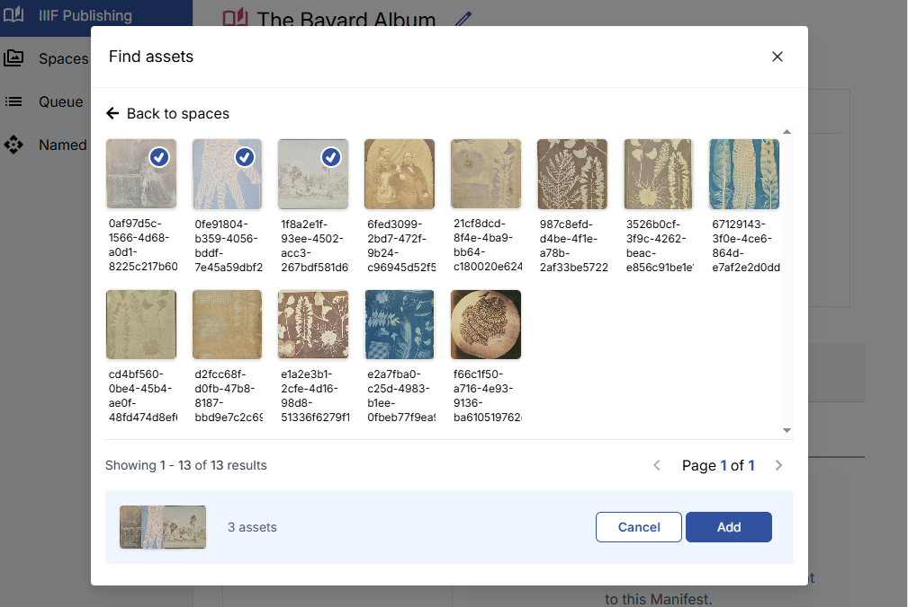

Once selected, click **Add**. The images will be listed in order in the Manifest view.

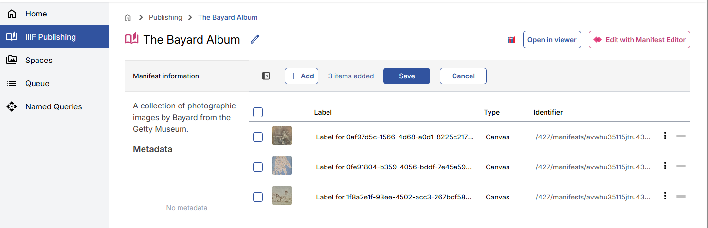

<Aside type="note">
Click **Save** to apply additions to your Manifest. Clicking **Cancel** will remove them.
</Aside>

### Pending assets

When the Asset Selector modal is open, if you close it or click outside while assets are selected, those assets are retained in a **Pending Assets** list and can be added later.

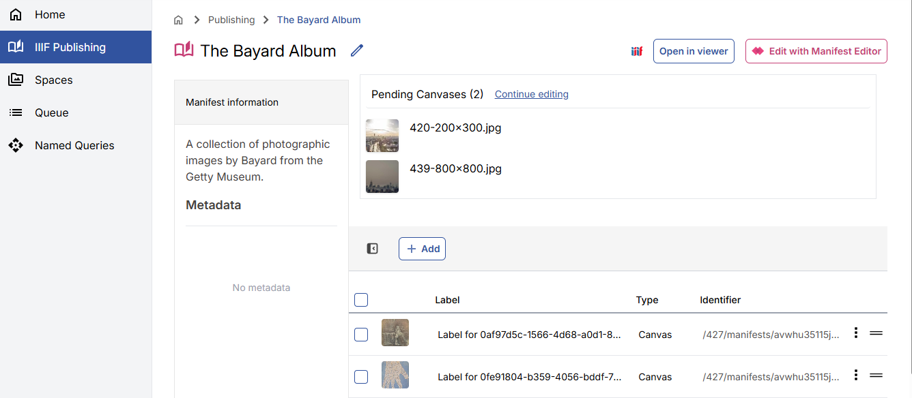

### Settings

By default, assets are labelled with their Asset ID in the selector. You can change this so that a metadata string field (string1, string2, or string3) is used as the label instead.

From the **User Menu** in the header, select **Settings**.

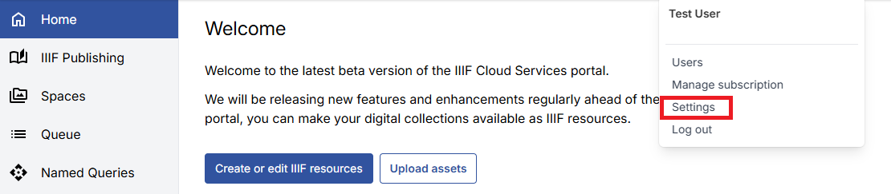

Select the metadata field you would like to use for labels, then click **Save settings**.

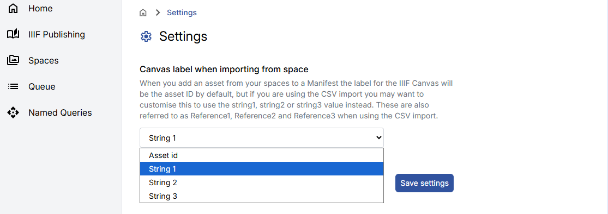

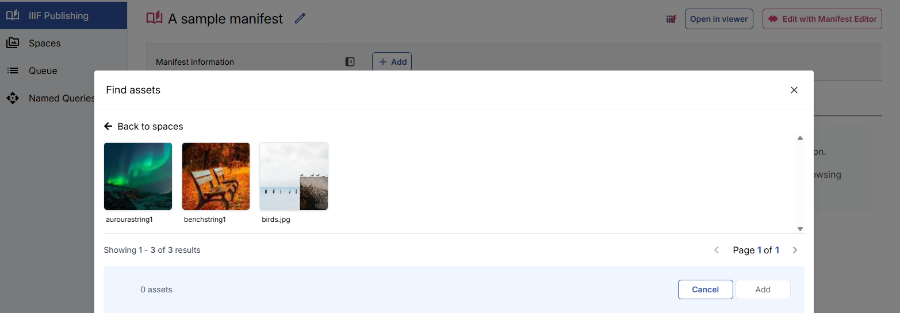

If the selected field is empty for an asset, the Asset ID is used as a fallback.

### Viewing the manifest

Using the **Open in Viewer** option, you can view your Manifest in any of the following IIIF viewers:

- Theseus
- Universal Viewer
- Mirador

A link to the IIIF Manifest (via the IIIF icon) is also available to drag and drop into IIIF viewers.

## Reordering and deleting canvases

You can reorder and delete Manifest items directly in the portal Manifest view.

### Drag and drop

In the Manifest listing view, drag individual items up or down. The drop position is indicated by a red line.

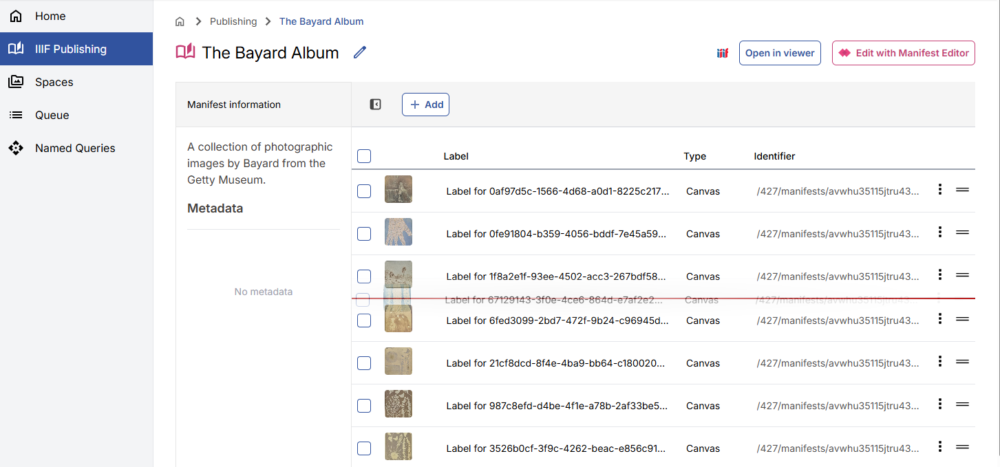

### The three-dots menu

Each item has a **⋮** (vertical ellipsis) menu offering **Delete**, **Move to start**, and **Move to end** options.

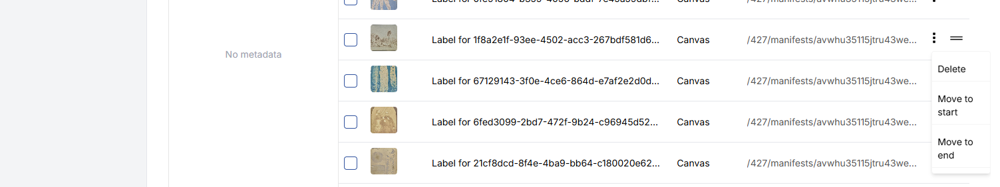

### Deleting multiple items

Use the checkboxes on the left to select multiple items, then click the **Delete** menu that appears above the table. You will be asked to confirm the deletion.

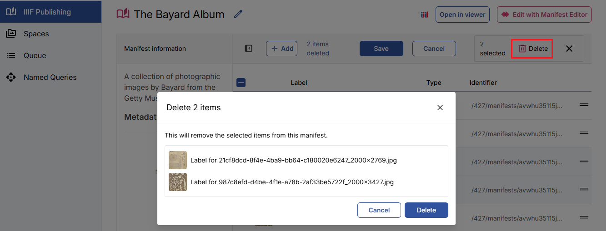

### Moving multiple items

With multiple items selected, you can drag them together. The labels of the selected items are shown while dragging, along with a red line indicating the drop position.

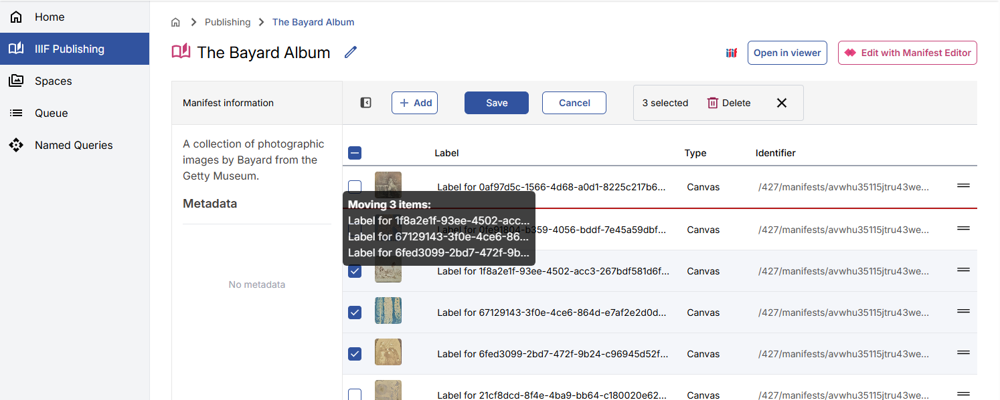

### Saving changes

After moving, deleting, or adding items, click **Save** to apply your changes. Clicking **Cancel** will undo them.

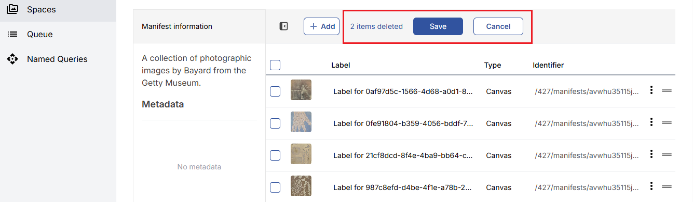

If you navigate away from the page without saving, a modal prompts you to confirm.

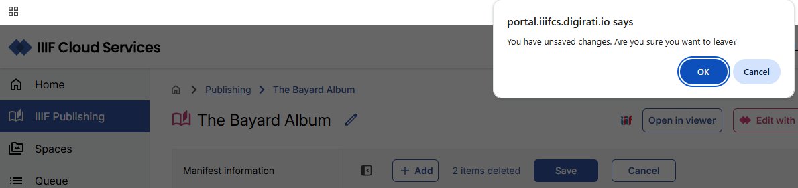

## Edit with the Manifest Editor

The **Edit with Manifest Editor** option opens the full Manifest Editor, which provides extensive editorial capabilities.

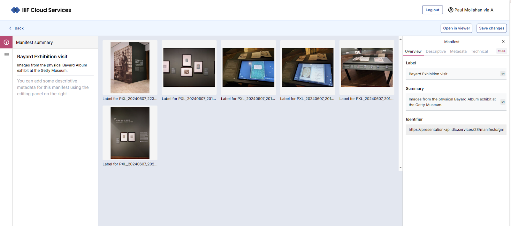

The default view shows the Manifest summary in the left panel and detailed metadata in the right panel.

To add metadata, navigate to the **Metadata** tab in the right panel and add the appropriate values.

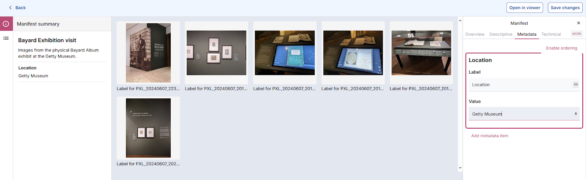

After making changes, use **Save changes** to save. You can then view the updated Manifest using **Open in viewer**.

Clicking the **Canvases** icon in the left panel navigates to the Canvas view, where the right panel shows metadata for the first Canvas.

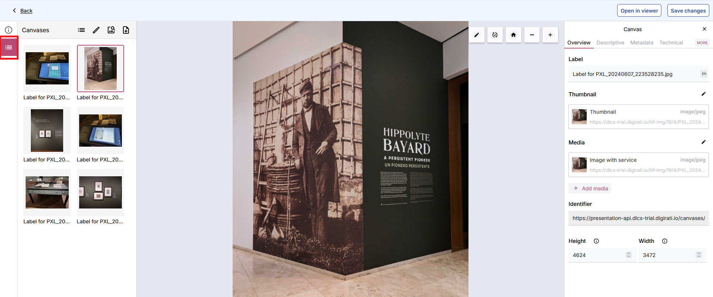

In the Canvas view you can edit the metadata for each Canvas using the right panel.

To reorder Canvases, click the **Edit Canvases** (pencil) icon in the left panel. Use the **=** icon to drag canvases into a new order.

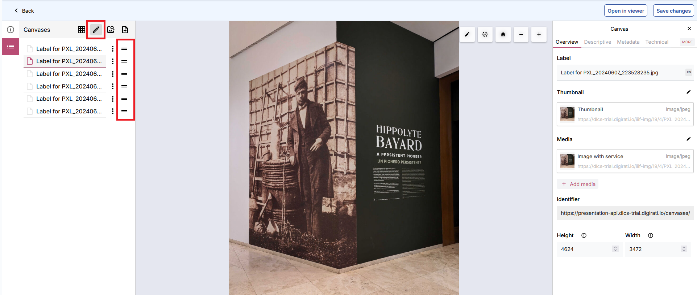

Additional options including **Delete** are available from the **⋮** menu next to each Canvas label.

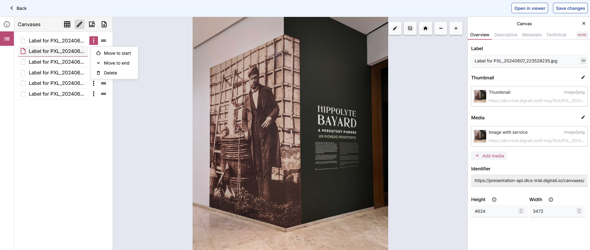

Once you have completed your Canvas updates, click **Save changes**.

### Setting a thumbnail for your manifest

- Click the icon to view the Manifest summary.

- In the right panel, click the **Descriptive** tab, then select **Add thumbnail**.

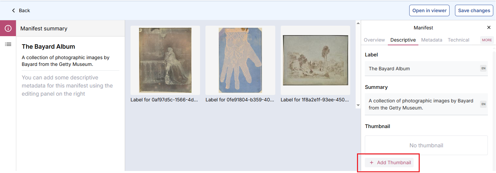

- A modal appears with options. Select **Thumbnail (from your Spaces)** to choose an asset from your Spaces.

Browse your Spaces for your chosen asset and click to select it. (Only one asset can be selected at a time in this mode.)

Click **Add**. The selected asset will be set as the Manifest thumbnail, and the right panel will show the ContentResource view with the thumbnail displayed.

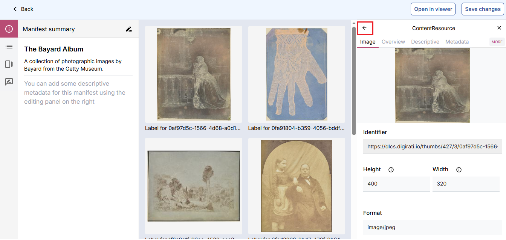

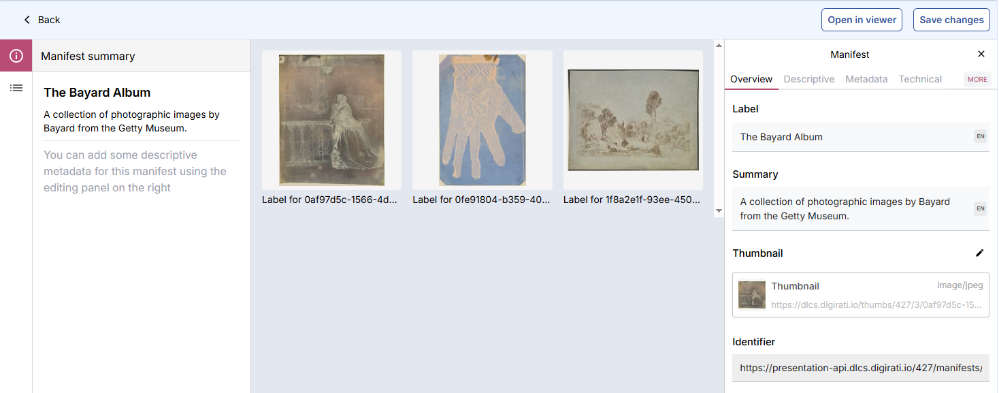

### Setting a thumbnail for an individual canvas

By default, each Canvas with a single image asset uses a scaled-down version of that image as its thumbnail. You can override this:

- Click **Canvases** and select the Canvas to update.
- Click the **Descriptive** tab in the right panel.
- Next to the **Thumbnail** sub-heading, click the pencil icon. Then click the **⋮** menu and select **Delete** to remove the existing thumbnail.

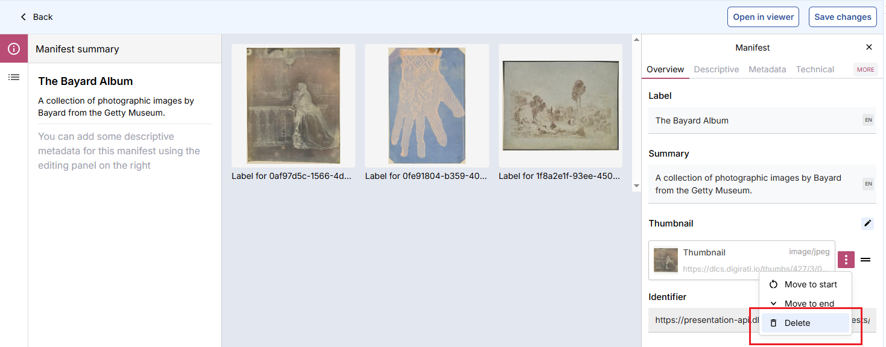

- Click **Add thumbnail** and choose your replacement. Use the **Back** link to confirm the selected thumbnail.

## Canvas list or grid view

When you open a Manifest in the Manifest Editor and access the Canvas view, the List view is shown by default. You can switch to **Grid view**.

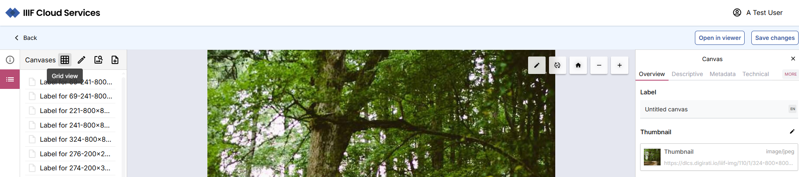

The Grid view allows you to edit and update Canvas content and order. The **List view** link returns you to the List view.

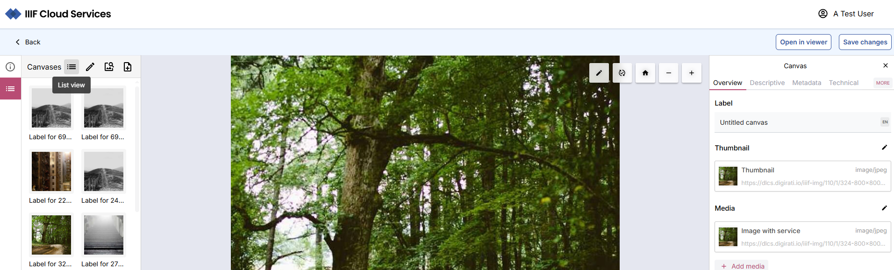

## Adding assets using the Manifest Editor

When a Manifest is open in the Manifest Editor, click the **Canvases** icon to access the Canvas list, then click **Add new canvas**.

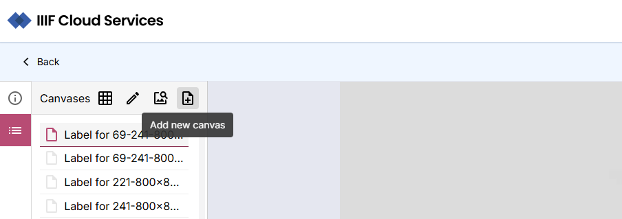

This opens a modal with content options.

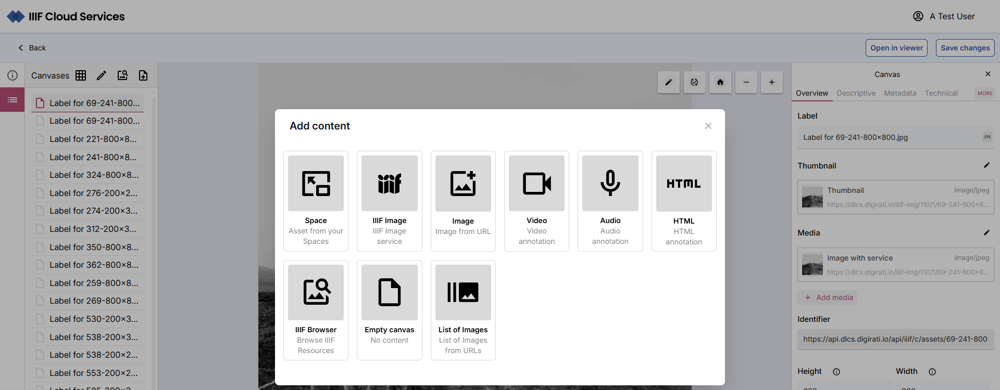

### Space (asset from your Spaces)

Select **Space (Asset from your spaces)** to choose an asset from one of your Spaces. You will see a list of your Spaces.

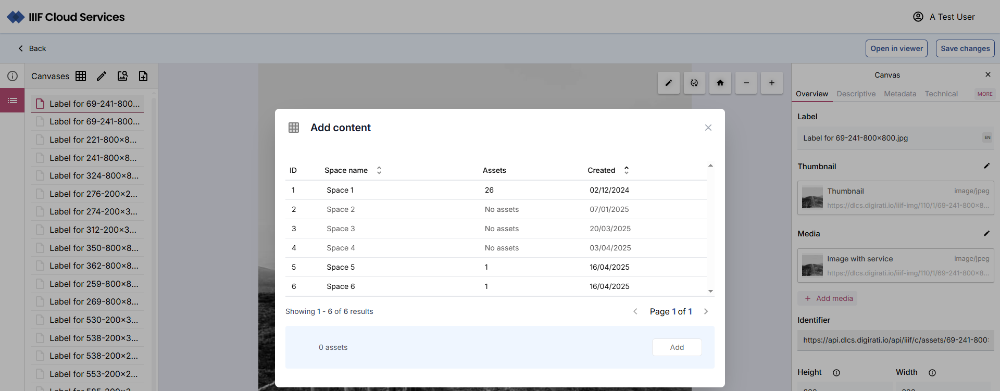

Click a Space, then select an asset by clicking its thumbnail.

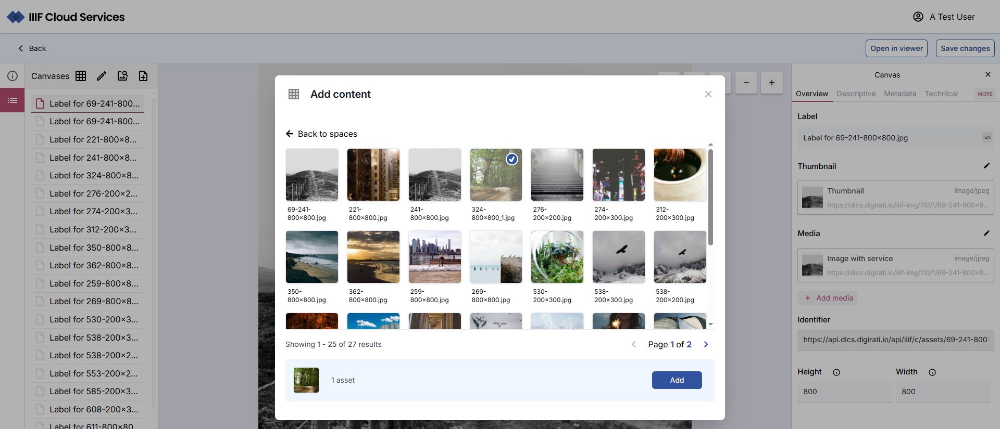

Click **Add**. An Untitled Canvas containing the selected asset is added to your Manifest.

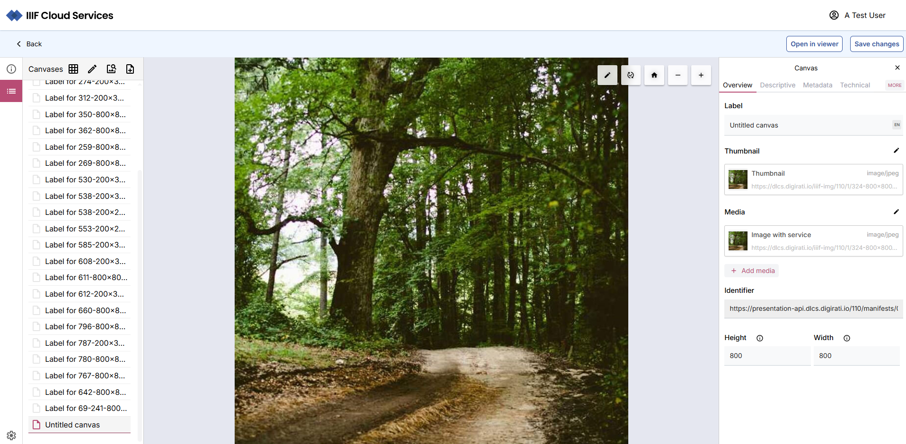

<Aside type="note">
From the Manifest Editor you can only select a single asset at a time.
</Aside>

### IIIF Image (IIIF Image Service)

Paste the URL of a IIIF image resource or a link to its `info.json`. Preview the image, then add a Canvas with that image service.

### Image (Image from URL)

Paste any image URL from the web. Preview the image, then add a Canvas with that image.

### Video (Video annotation)

Paste the URL of a video resource from the web. Preview it, then click **Add video** to add a Canvas with that video as an annotation.

### Audio (Audio annotation)

Paste the URL of an audio resource from the web, then click **Add audio** to add a Canvas with that audio as an annotation.

### HTML (HTML annotation)

Type or paste in HTML code, then click **Create** to add a Canvas with the HTML as a text annotation.

### Empty Canvas

Creates an empty canvas onto which you can add content — for example, to add multiple images to a single canvas.

### List of Images (Images from URLs)

Paste multiple image URLs from the web, one per line. A Canvas containing each image will be added. IIIF-enabled assets are recognised automatically.

### IIIF Browser

The IIIF Browser lets you explore published IIIF Collections and Manifests. You can search, navigate, and import content directly into your Manifests.

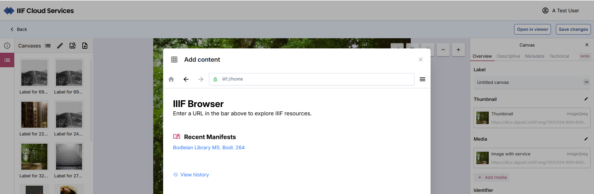

Paste the URL of a IIIF Manifest to open it.

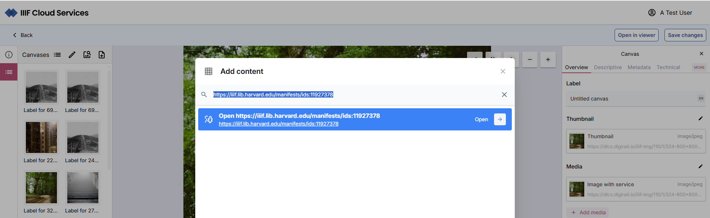

Browse its Canvases and click a thumbnail to view it.

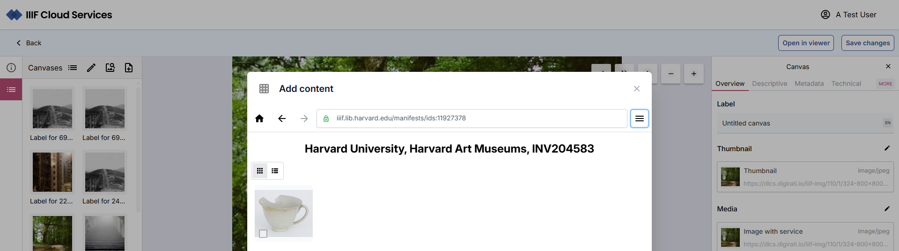

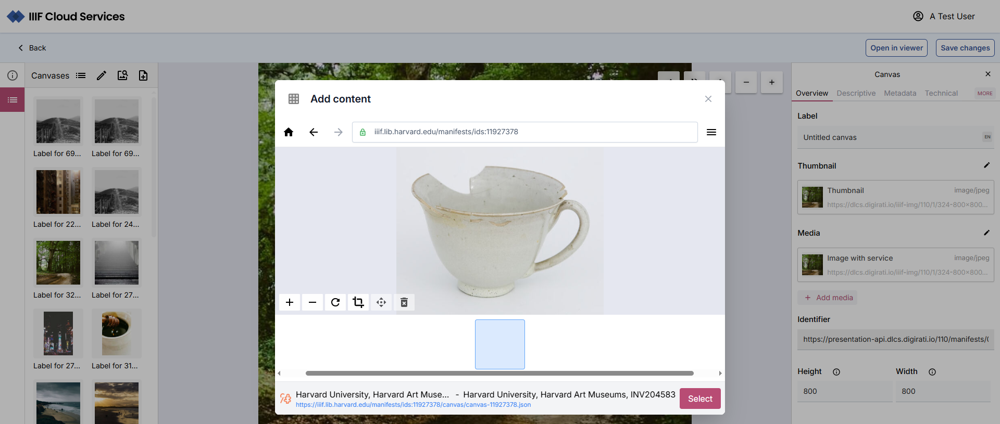

You can crop images using the image tools available in the Canvas view and select only the crop to add to your Manifest.

<Aside type="note">
Not all IIIF viewers support cropped region annotations.
</Aside>

Clicking **Select** adds the current item to your Manifest.

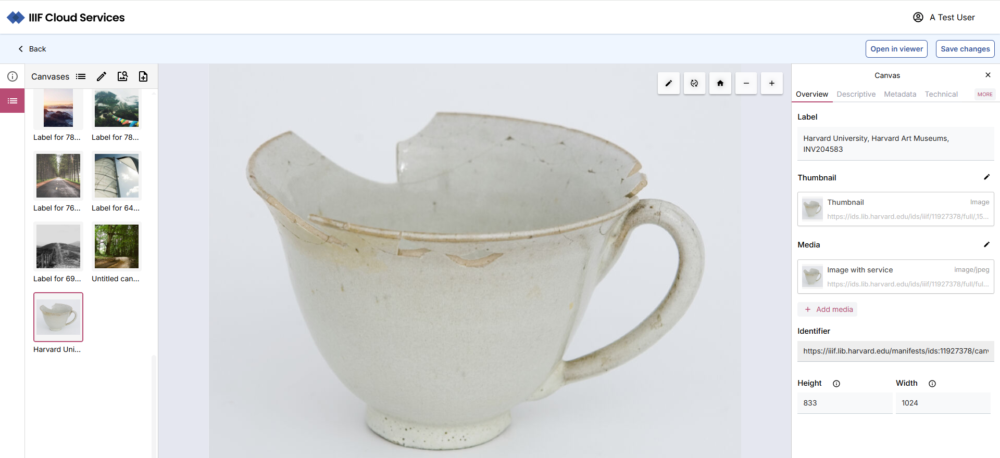

## Importing an existing manifest

Navigate to the IIIF Publishing area and select the folder into which you want to import the manifest. Click **New**, then select **Import Manifest**. Enter the URL of a valid IIIF Manifest and click **Import**.

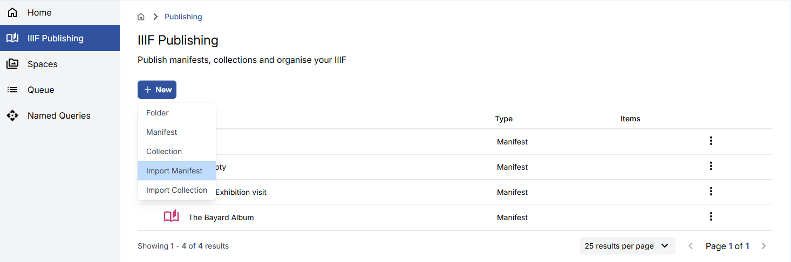

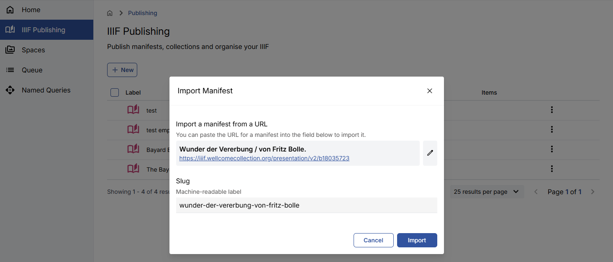

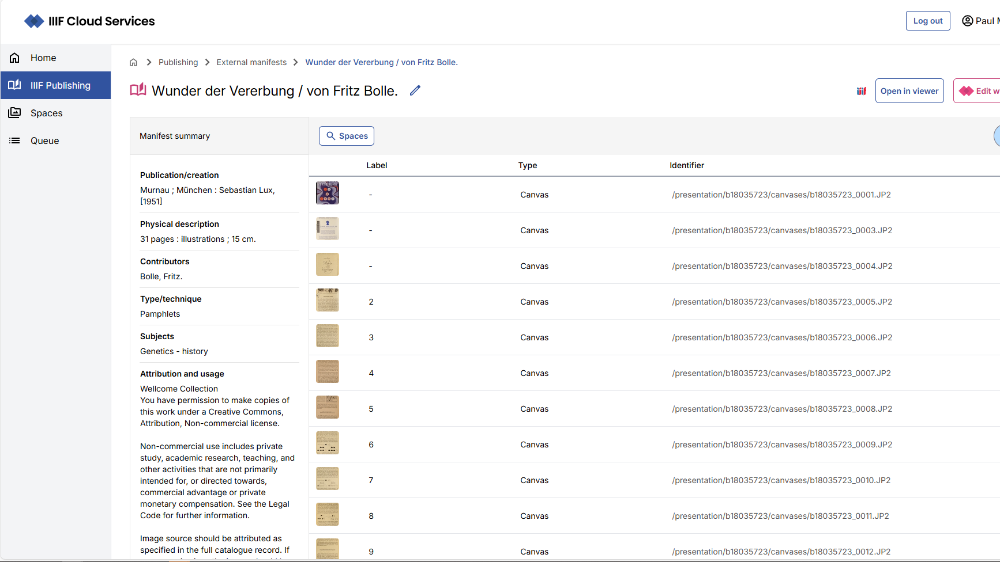

You can view and edit the imported Manifest in the standard view or by selecting **Edit with Manifest Editor** for advanced editing features.
