import { Aside } from '@astrojs/starlight/components';

The portal enables you to create Manifest templates that pre-define metadata structures. Manifests created from a template inherit those metadata fields automatically. This section also covers moving and deleting IIIF content in the Publishing area.

## Managing IIIF content using templates

### Creating a Templates folder

Templates are stored in a dedicated folder named **Templates**. Once created with this exact name, the portal recognises it as a templates folder.

- Use the left-hand navigation to go to the **IIIF Publishing** area.
- Click **New**, then **Folder**. Enter `Templates` as the folder name and click **Create**.

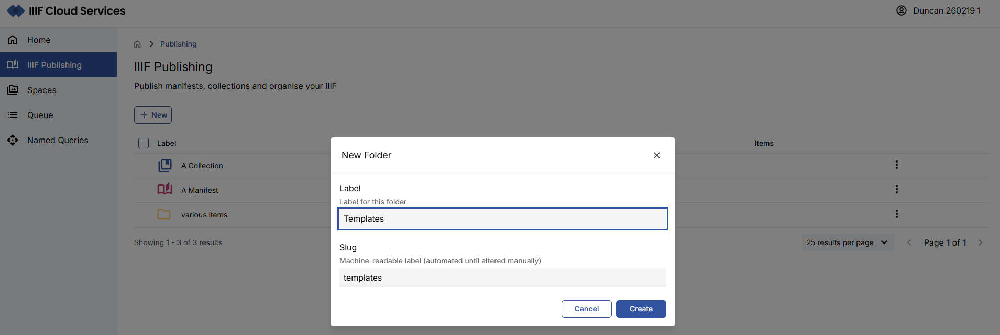

This redirects you to your new Templates folder, which has a distinct icon to distinguish it from regular folders.

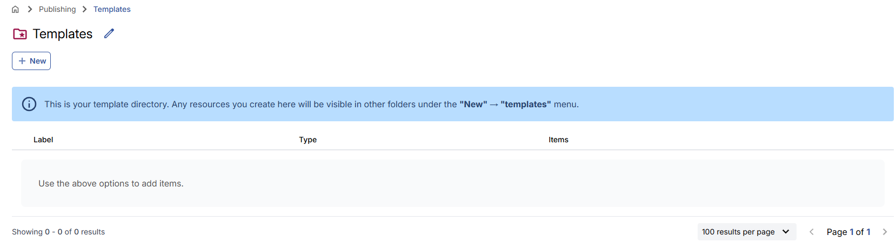

### Creating a manifest template

Manifest Templates are created within the Templates folder and support the pre-definition of metadata for future IIIF Manifests.

- Navigate to the Templates folder.
- Click **New** and select **Manifest template**.

<Aside type="note">
You must be inside the Templates folder to see the **Manifest template** option.
</Aside>

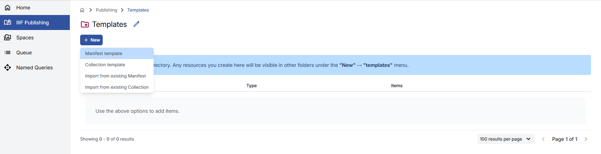

- Provide a **Label** and optional **Summary** for the template.
- The **Slug** will be auto-generated but can be changed.

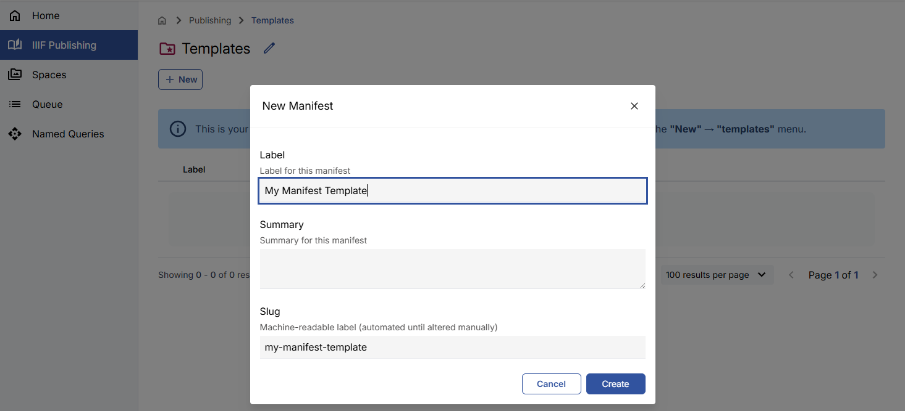

- Click **Create**. You will be redirected to the new Manifest Template view.

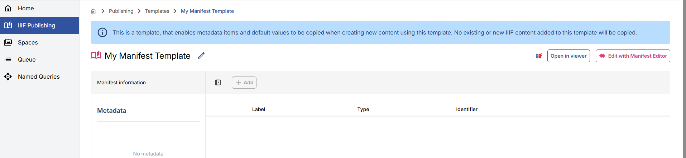

### Editing a manifest template

To edit the template, open it in the Manifest Editor:

- Click **Edit with Manifest Editor** from the Manifest Template view.
- In the right panel, click the **Metadata** tab.

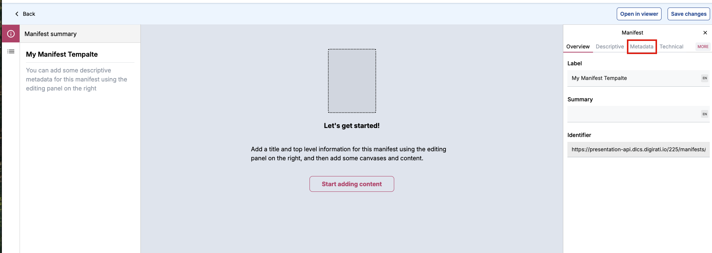

- Click **Add metadata item** and fill in the label and value fields.
- Click **Save Changes**.

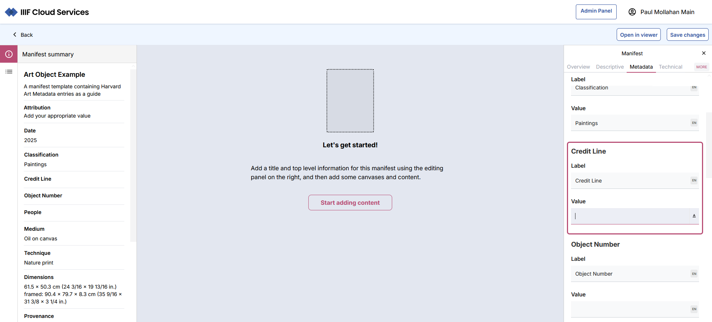

You can add as many metadata fields as needed. These values will appear pre-populated when you create a new Manifest from this template. They can be edited at that point if required.

### Creating a manifest from a template

- From the IIIF Publishing area, navigate to the location where you want to create the new Manifest.
- Click **New** and scroll to the bottom of the list to find your templates.

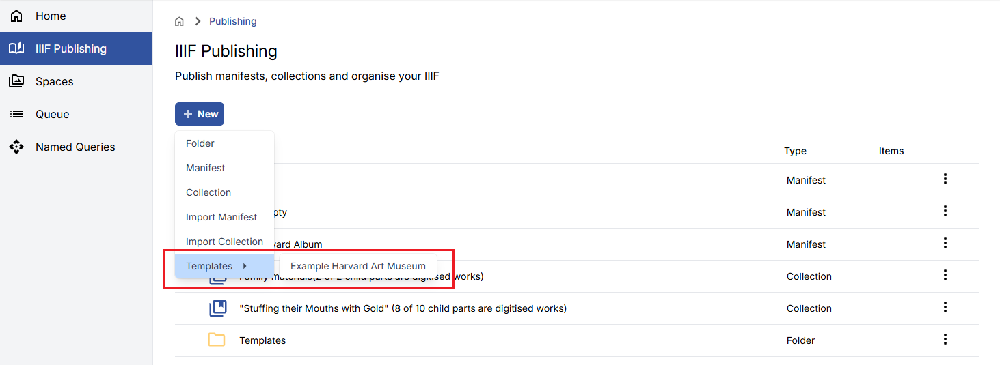

- Fill in the **Label** (a slug will be generated automatically).

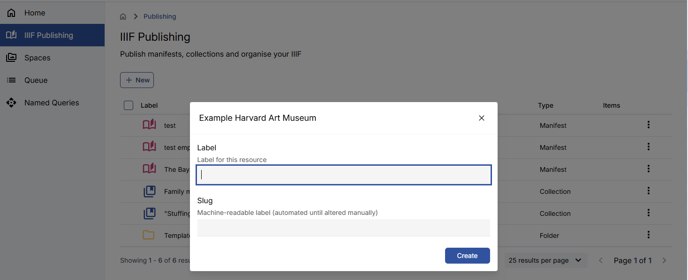

- Click **Create**.

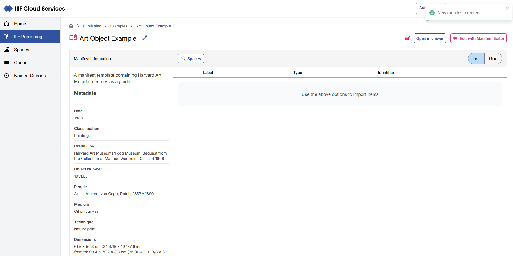

<Aside type="note">
Changes made to a Template after Manifests have been created from it will not be applied retroactively to those existing Manifests.
</Aside>

## Moving IIIF content

You can reorganise your IIIF content using the Move functionality. Hover over an item in the IIIF Publishing listing to reveal its checkbox. Select one or more items.

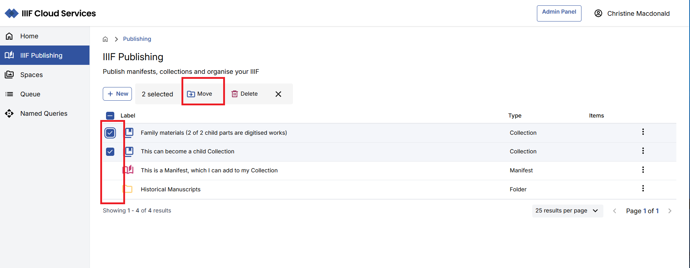

Click **Move**. The IIIF Browser opens, allowing you to select a destination folder. You can either check the checkbox next to the folder or navigate into it, then click **Move here**.

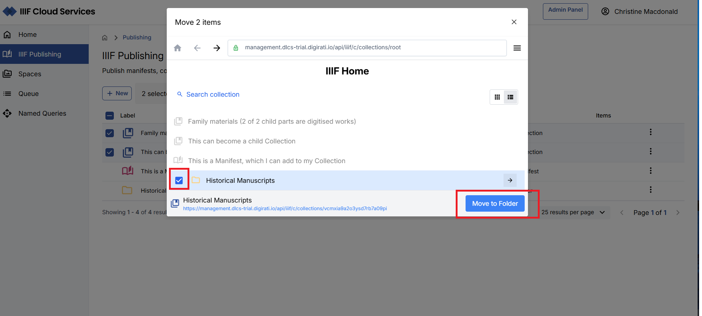

<Aside type="note">
If a slug conflict exists at the destination, the move will not proceed.
</Aside>

You can also drag an item directly into a visible folder in the listing.

## Deleting IIIF content

### Deleting an individual item

Navigate into the Folder, Manifest, or Collection, click the **pencil** icon, and select **Delete**. Confirm the deletion in the modal.

<Aside type="note">
You cannot delete a Folder that still contains content. Move or delete the content first.
</Aside>

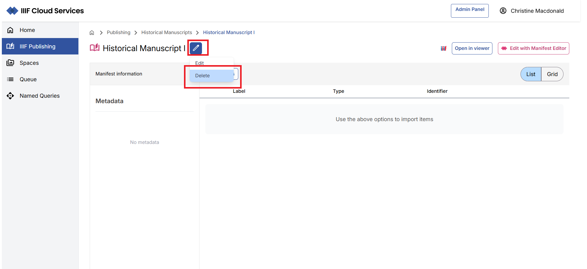

### Bulk deleting content

Use checkboxes to select multiple items, then click **Delete** when it appears. Confirm the deletion in the modal. Items that cannot be deleted (e.g. non-empty folders) will be listed separately.

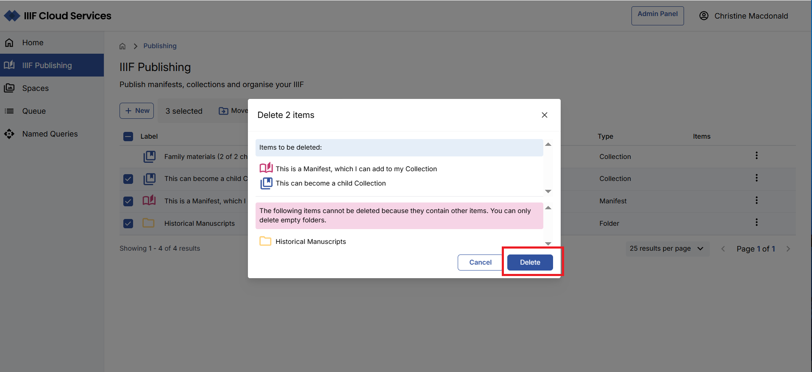

## Using the API to create and update IIIF content

Manifests may be ingested into the IIIF Cloud Service via automated processes using available APIs — for example, from a process that combines data from a collection management system with assets already registered in the platform. These scenarios can be discussed with your Digirati contact.
