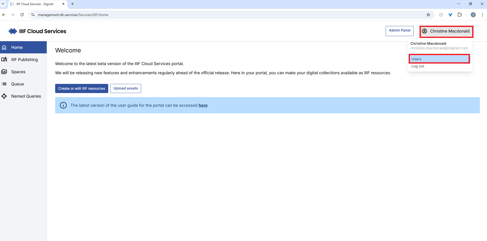
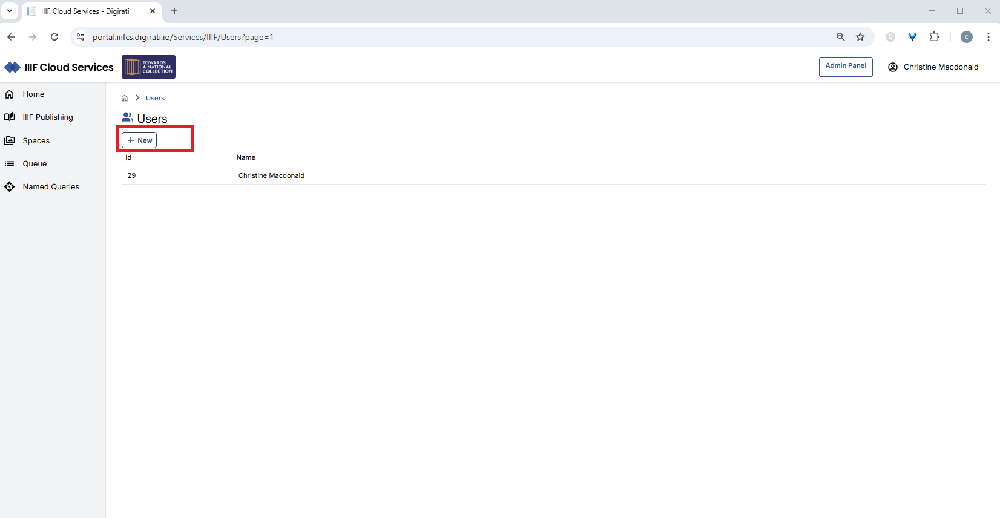
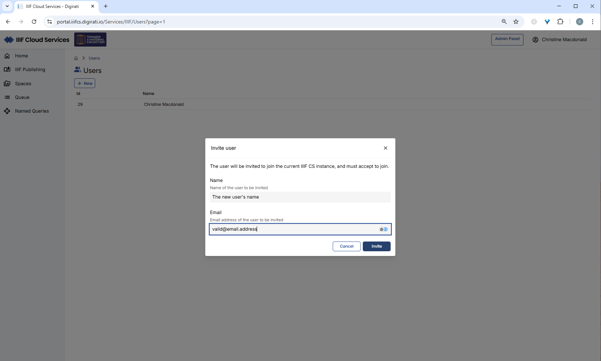
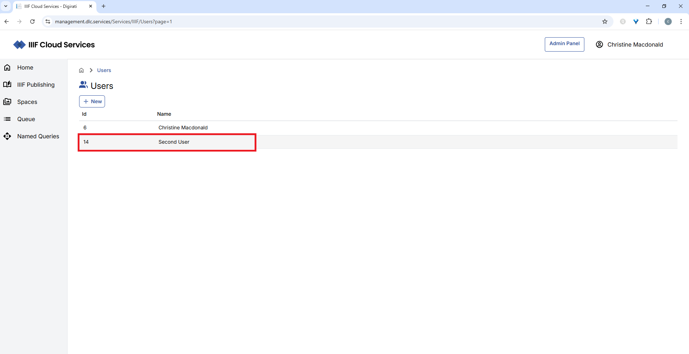
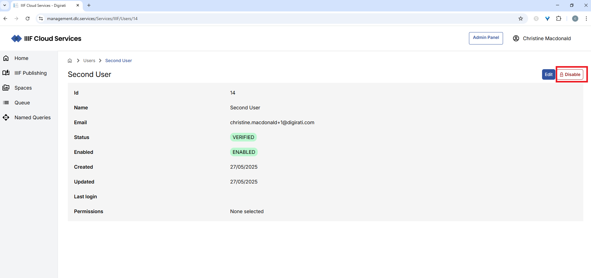
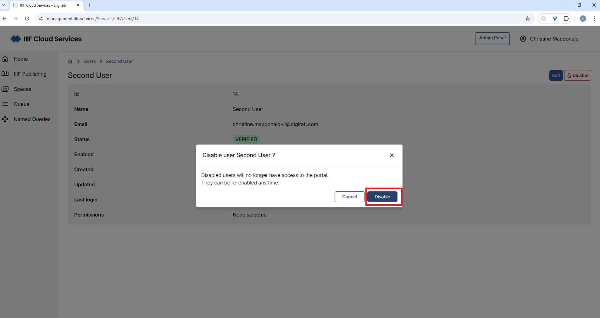
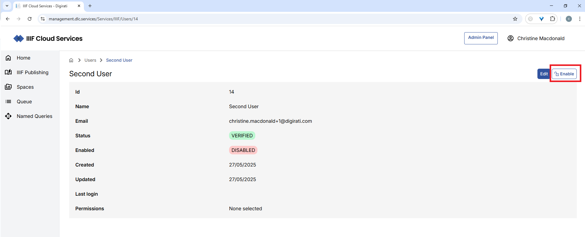
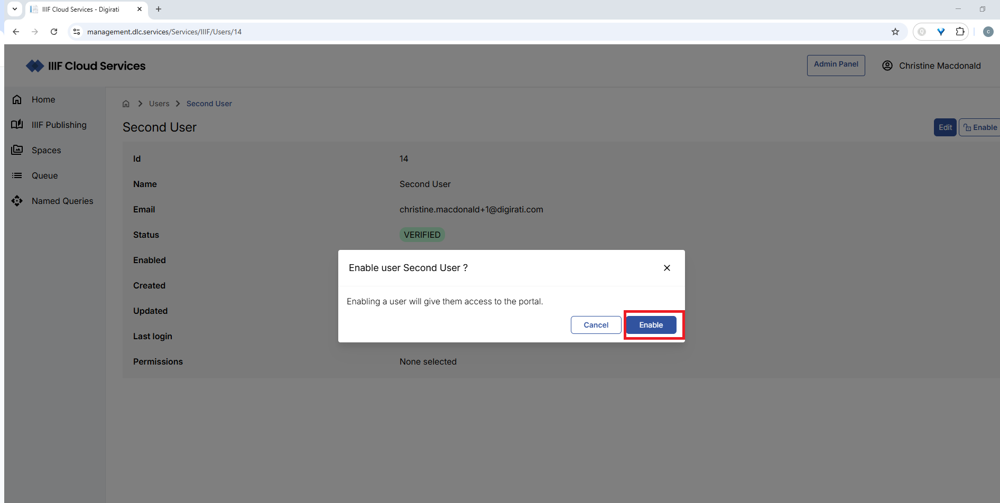

import { Aside } from '@astrojs/starlight/components';

When you sign up for a portal account, you become the account owner and your user account is granted **Account Administrator** permissions. Depending on your subscription, you can invite additional users to access the portal.

## Inviting a new user

After logging in, click your name in the top-right corner and select **Users**.

You will see your own user listed, along with the option to add a new user. Click **+New**.

Enter the new user's name and email address. The email address must not already be in use within any other Customer account on the platform.

Click **Invite**. The new user's status will be **Unverified** until they follow the verification link in the invitation email. Once verified, their status changes to **Verified**.

## Disabling a user

You may need to disable a user account, for example when someone leaves your organisation.

After logging in, click your name in the top-right corner and select **Users**.

Click on the user you want to disable.

Click the **Disable** button.

Confirm by clicking the second **Disable** button, or click **Cancel** to abort.

You can re-enable a disabled user at any time by following the same steps and clicking **Enable**.

---

For help with any aspect of the portal, contact [support.iiif-cs@digirati.com](mailto:support.iiif-cs@digirati.com).
